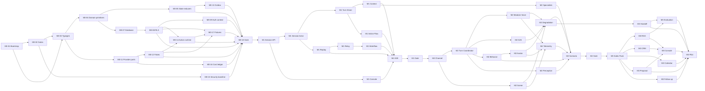

# Dependency Graph

```mermaid
flowchart LR
  M001[M0-01 Bootstrap] --> M002[M0-02 Gates]
  M001 --> M003[M0-03 Typegen]
  M002 --> M003
  M003 --> M004[M0-04 Domain primitives]
  M004 --> M005[M0-05 State reducers]
  M004 --> M007[M0-07 Database]
  M007 --> M008[M0-08 RLS]
  M008 --> M009[M0-09 Auth context]
  M003 --> M011[M0-11 Provider ports]
  M011 --> M012[M0-12 Fakes]
  M005 --> M013[M0-13 Outbox]
  M008 --> M014[M0-14 Action runtime]
  M012 --> M014
  M002 --> M015[M0-15 Security baseline]
  M011 --> M016[M0-16 Cost ledger]
  M008 --> M017[M0-17 Fixtures]
  M012 --> M017
  M014 --> M017
  M005 --> M018[M0-18 Gate]
  M008 --> M018
  M009 --> M018
  M012 --> M018
  M013 --> M018
  M014 --> M018
  M015 --> M018
  M016 --> M018
  M017 --> M018

  M018 --> M101[M1 Session API]
  M101 --> M102[M1 Session Actor]
  M102 --> M103[M1 Turn Driver]
  M103 --> M104[M1 Context]
  M103 --> M105[M1 Action Flow]
  M102 --> M106[M1 Replay]
  M106 --> M107[M1 Relay]
  M107 --> M108[M1 Workflow]
  M101 --> M109[M1 Console]
  M104 --> M110[M1 E2E]
  M105 --> M110
  M106 --> M110
  M108 --> M110
  M109 --> M110
  M110 --> M111[M1 Gate]

  M111 --> M201[M2 Channel]
  M201 --> M202[M2 Turn Coordinator]
  M202 --> M203[M2 Modular Voice]
  M202 --> M204[M2 S2S]
  M202 --> M205[M2 Behavior]
  M205 --> M206[M2 Avatar]
  M201 --> M207[M2 Scene]
  M104 --> M208[M2 Specialists]
  M202 --> M209[M2 Perception]
  M203 --> M210[M2 Degradation]
  M204 --> M210
  M206 --> M210
  M207 --> M210
  M203 --> M211[M2 Telemetry]
  M206 --> M211
  M207 --> M211
  M205 --> M212[M2 Scenario]
  M208 --> M212
  M209 --> M212
  M210 --> M212
  M211 --> M212
  M212 --> M213[M2 Gate]

  M213 --> M301[M3 Sales Pack]
  M301 --> M302[M3 RAG]
  M301 --> M303[M3 CRM]
  M301 --> M304[M3 Calendar]
  M301 --> M305[M3 Proposal]
  M210 --> M306[M3 Handoff]
  M301 --> M307[M3 Follow-up]
  M302 --> M308[M3 Evaluation]
  M306 --> M308
  M302 --> M309[M3 Console]
  M303 --> M309
  M305 --> M309
  M304 --> M310[M3 Pilot]
  M305 --> M310
  M306 --> M310
  M307 --> M310
  M308 --> M310
  M309 --> M310
```
