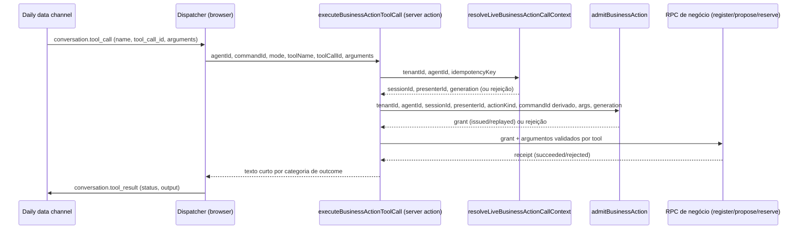

# ADR-041: Funil de tool call de ação de negócio da chamada de vídeo ao vivo

**Status:** Proposto (2026-08-29). O desenho do funil em si (roteador cliente, resolução de sessão ao vivo, chamada da RPC de admissão e da RPC de negócio, texto de resposta ao modelo) não depende de nenhuma decisão pendente e pode começar a ser implementado. Os pontos marcados em "Decisões do dono do produto" abaixo (registro de tool no Tavus como operação governada, ordem de sequenciamento com a onda de `confirm_meeting_slot`) precisam de aprovação de Fernando Silva antes de qualquer tenant real ser afetado.
**Data:** 2026-08-29
**Relacionados:** Art. 2, Art. 3, Art. 5, Art. 6, Art. 7, Art. 8, Art. 9, Art. 14, Art. 15, Art. 16 da Constituição; ADR-004, ADR-010, ADR-034, ADR-036, ADR-038, ADR-039, ADR-040

## Contexto

Três ondas de trabalho já construíram, testadas e isoladas, as peças de um sistema de ação de negócio dentro da chamada de vídeo: ADR-038 deu a toda sessão Portal um bridge de canal durável (sessão, disclosure, consentimento, floor, cena); ADR-039 deu a esse bridge uma extensão própria para `register_lead`, `propose_meeting_slots` e `confirm_meeting_slot`, com flag independente (`PORTAL_BUSINESS_ACTION_BRIDGE_ENABLED`) e tabelas/RPCs próprias; as ondas seguintes (1b-ii, 1b-iv) entregaram a custódia OAuth do Google Calendar e o adapter `packages/provider-google-calendar/src/index.ts`, que já sabe consultar FreeBusy, inserir evento com id gerado pelo chamador e reautenticar. Nenhuma dessas peças jamais foi exercitada por uma conversa real, porque a superfície que receberia a chamada do modelo recusa toda tool call hoje, sem exceção.

`apps/portal/src/app/(app)/agentes/[id]/testar/presentation-room.tsx`, função `handleToolCall` (linhas 212 a 236), escuta `conversation.tool_call` do Daily e responde `conversation.tool_result` com `status: "error"` para qualquer uma das três tools de cena já existentes (`next_slide`/`previous_slide`/`go_to_slide`), incondicionalmente. O comentário no topo do arquivo confirma que isso é intenção, não lacuna: "esta tela nunca altera o palco a partir delas". Não existe hoje nenhum caminho, condicional ou não, que chame um Server Action a partir de uma tool call.

`apps/portal/src/app/(app)/agentes/[id]/testar/video-call.tsx` (modo vídeo livre, sem deck) é mais grave que "falta o handler": o componente inteiro embute a Tavus por `<iframe src={trustedUrl}>` puro, sem nunca instanciar `DailyIframe.createCallObject()`. O comentário de `presentation-room.tsx` sobre por que aquele componente usa `@daily-co/daily-js` em vez de iframe é explícito: "necessária porque o iframe não dá acesso ao data channel dos tool calls" (D-V2-074, `docs/operations/DECISIONS_LOG.md`). Ou seja, uma tool call em modo vídeo livre não chega ao navegador de jeito nenhum hoje, não é uma questão de "adicionar um listener" isolado: o transporte que `video-call.tsx` usa estruturalmente não entrega `app-message`.

`packages/provider-tavus/src/index.ts`, `attachToolsToPersona(personaId, toolIds)` (linhas 81 e 315-322), é a única peça de código deste repositório capaz de ligar uma tool já cadastrada no Tavus a uma persona. Ela nunca é chamada por nenhum código do app: `tests/portal/m5-01-integrity.test.mjs:58` afirma isso como invariante (`assert.doesNotMatch(agentVideo, /createTavusVideoConversationPort|\.createPersona\(|attachToolsToPersona\(/)`), e `apps/portal/src/lib/agent-video.ts` documenta por que, na própria função `provisionAgentVideoIfMissing`: criação real de persona é bloqueada de propósito (`durable_persona_intent_required`) até existir um fluxo de onboarding durável que ainda não foi construído. As três tools de cena que existem HOJE no Tavus (`next_slide`/`previous_slide`/`go_to_slide`, registradas via `/v2/tools` e anexadas via `/v2/pals/{id}/tools`) foram criadas por uma operação manual de uma vez só, fora de qualquer código deste repositório, contra três personas específicas (Aurora, Amanda, Rafaela), registrada apenas como entrada de decisão (D-V2-074). Nenhuma tool de negócio jamais foi registrada no Tavus.

O lado servidor de `register_lead` já está pronto de ponta a ponta: `apps/portal/src/lib/runtime/portal-business-action-bridge.ts` exporta `admitBusinessAction`/`registerBusinessLead`, chamando as RPCs `portal_admit_business_action_service`/`portal_register_business_lead_service` da migration `database/supabase-only/0051_business_action_admission_and_leads.sql`. Mas o mesmo módulo TypeScript restringe `ACTION_KINDS` a `new Set(["register_lead"])` e o tipo `PortalBusinessActionKind` é `"register_lead"` sozinho: não existe hoje nenhum wrapper TypeScript para `propose_meeting_slots`/`confirm_meeting_slot`, mesmo essas duas tendo RPCs completas em `database/supabase-only/0052_business_action_calendar_scheduling.sql` (`portal_propose_business_meeting_slots_service`, `portal_reserve_business_meeting_slot_service`, `portal_dispatch_business_meeting_reservation_service`, `portal_commit_business_meeting_reservation_service` e as demais). `packages/provider-google-calendar/src/index.ts` documenta a própria lacuna no topo do arquivo: "Este pacote ainda não está conectado a nenhuma Server Action (fora de escopo desta rodada)". `apps/portal/src/lib/actions/calendar-connection.ts` só cobre conectar/desconectar OAuth (onda 1b-ii); nenhum Server Action chama `queryFreeBusy`/`insertEvent`.

O sandbox de chat de texto não é um atalho para testar nada disso: `apps/portal/src/lib/actions/agent-preview.ts` não tem conceito de `sessionId`/`presenterId` (nenhuma ocorrência das duas strings no arquivo), e `packages/provider-openrouter/src/index.ts` não envia `tools`/`tool_choice` nem lê `message.tool_calls` (nenhuma ocorrência de nenhum dos dois). `portal_admit_business_action_service` exige `sessions.disclosure_status='delivered'`/`consent_status='granted'` já existentes para a sessão referenciada; a única função que escreve essas colunas é `portal_admit_runtime_channel_service` (0043), que só aceita `p_channel_kind in ('tavus_video','recall_meeting')`. Ação de negócio é estruturalmente dependente de uma sessão de vídeo ou meeting já admitida, nunca de chat.

Este ADR desenha o fio que falta: como uma tool call que chega pelo canal de dados do Daily durante uma chamada real vira, do outro lado, uma execução de `BusinessActionIntent` sobre estado durável, com uma resposta curta e segura de volta ao modelo. Ele assume como fato já decidido tudo que ADR-038 e ADR-039 já resolveram (grant, kill switch, flags independentes, receipts) e não redesenha nenhuma dessas peças.

## Decisão

### Um roteador único de tool call, particionado por `action_kind`, nunca por string solta duas vezes

`presentation-room.tsx` e `video-call.tsx` precisam do mesmo comportamento de roteamento; hoje só o primeiro tem qualquer comportamento, e mesmo esse é uma constante de rejeição hardcoded numa lista inline (`["next_slide", "previous_slide", "go_to_slide"]`, linha 218). Este ADR propõe extrair essa decisão para um módulo novo e único, `apps/portal/src/lib/runtime/tool-call-names.ts`, com duas allowlists fechadas e disjuntas:

```text
SCENE_TOOL_NAMES = ["next_slide", "previous_slide", "go_to_slide"]
BUSINESS_ACTION_TOOL_NAMES = ["register_lead", "propose_meeting_slots", "confirm_meeting_slot"]
```

Um dispatcher cliente novo, compartilhado pelos dois componentes (`apps/portal/src/app/(app)/agentes/[id]/testar/tool-call-dispatcher.ts`, uma função pura chamável a partir do handler `call.on("app-message", ...)` de cada componente, não um novo componente React), examina `message.properties.name` e decide entre três caminhos, nunca dois: nome em `SCENE_TOOL_NAMES` vai para o caminho de cena (ADR-038, `PORTAL_RUNTIME_BRIDGE_ENABLED`); nome em `BUSINESS_ACTION_TOOL_NAMES` vai para o caminho de negócio (ADR-039, `PORTAL_BUSINESS_ACTION_BRIDGE_ENABLED`, desenhado em detalhe abaixo); qualquer outro nome recebe exatamente a mesma rejeição local incondicional, sem chamada de rede, que `presentation-room.tsx` já aplica hoje às três tools de cena (Art. 15, um nome de tool desconhecido é dado não confiável por padrão).

A separação é estrutural, não de nomenclatura: o dispatcher chama duas Server Actions diferentes (`executePortalSceneToolCall`, já coberta em desenho pelo ADR-038 embora nunca ligada a este dispatcher, e `executeBusinessActionToolCall`, desenhada abaixo, nova neste ADR), e cada uma checa sua própria flag internamente sem nunca importar a outra. A independência entre `PORTAL_RUNTIME_BRIDGE_ENABLED` e `PORTAL_BUSINESS_ACTION_BRIDGE_ENABLED` que ADR-039 já garante no lado do servidor (`portal-business-action-bridge.ts` nunca importa `portal-channel-runtime-bridge.ts`) se reflete no lado do cliente da mesma forma: o dispatcher nunca decide qual flag está ligada, apenas encaminha por nome de tool; quem decide se a ação prossegue é sempre o servidor.

Wire o caminho de cena até `executePortalSceneIntent` (que já existe em `portal-channel-runtime-bridge.ts`, linha 618, completo desde ADR-038) fica fora do escopo de entrega deste ADR, porque o arquivo tem "business-action-tool-call-funnel" no nome e o pedido de Fernando foi atacar especificamente o bloqueio de negócio. Mas nada neste desenho impede que o mesmo dispatcher sirva às duas: a reserva de `SCENE_TOOL_NAMES` acima existe exatamente para que ligar o caminho de cena, quando alguém decidir fazê-lo, seja trabalho de reaproveitamento (chamar uma função já pronta a partir de um roteador já pronto), não uma reformulação do roteador.

### `video-call.tsx` precisa trocar de transporte antes de poder ouvir qualquer tool call

Este é um achado de arquitetura, não uma escolha de implementação: o modo vídeo livre embute a sala Tavus via `<iframe src={trustedUrl} sandbox="allow-scripts allow-same-origin allow-forms allow-popups">` (linhas 84 a 92 de `video-call.tsx`). Um iframe cross-origin não expõe o data channel do Daily para o `window` pai; é por isso que `presentation-room.tsx` foi construído com `DailyIframe.createCallObject()` + `call.join({ url })` + elementos `<video>`/`<audio>` renderizados à mão, em vez de um iframe simples, como o próprio texto de D-V2-074 documenta. Adicionar um `handleToolCall` a `video-call.tsx` sem trocar esse transporte não teria efeito: não há evento para escutar.

A recomendação é migrar `video-call.tsx` para o mesmo padrão de `call object` que `presentation-room.tsx` já usa, reaproveitando a maior parte do código que hoje só existe lá (o tipo `DailyCall`, `attachTrack`, o `call.on("track-started", ...)`). Isso é trabalho de UI relativamente mecânico, sem tocar banco, auth, pagamento ou deploy, então não é risco ALTO na classificação de Fernando; mas é um escopo real de mudança que a pergunta original ("falta um listener em video-call.tsx") subestimava, e este ADR deixa isso explícito para não ser descoberto tarde durante a implementação. Uma extração de um componente de sala compartilhado (`DailyCallSurface`, usado pelos dois modos) é a forma natural de fazer isso sem duplicar a lógica de anexar track/tool call duas vezes; a divisão de responsabilidade entre o quê é específico de cada modo (deck navegável vs. simplesmente vídeo) e o quê é comum (join, tracks, dispatcher de tool call) fica para quem implementar, não é uma decisão de arquitetura que precise de ADR.

### Resolver sessão, presenter e geração de uma chamada já viva sem recriar o acoplamento que ADR-039 já proíbe

Este é o problema central que faltava resolver para o funil existir. `AdmitBusinessActionInput` (`portal-business-action-bridge.ts`, linha 53) exige `sessionId`/`presenterId` como parâmetros de entrada, resolvidos pelo chamador; a RPC `portal_admit_business_action_service` valida esses valores contra o estado durável (`sessions.active_presenter_id`, disclosure, consentimento), mas não os descobre sozinha. Em `startVideoConversation`/`startPresentationConversation`, esses valores existem em memória local por um instante, dentro do `runtimeGrant` devolvido por `admitPortalChannel` (linha 238/410 de `video-conversation.ts`), e nunca são persistidos para reuso: a chamada admite o canal, monta a URL, e a função retorna. Uma tool call chega minutos depois, numa requisição HTTP totalmente separada (o clique do usuário/evento do Daily), sem esse valor em memória nenhuma.

A opção mais óbvia, e a errada, seria a Server Action de tool call chamar `admitPortalChannel` de novo com o mesmo `commandId` (o grant é desenhado para ser replay-safe: ADR-038 descreve "It is one-time for provider dispatch; replay returns the same grant/result"). Isso funcionaria tecnicamente, mas recriaria exatamente o acoplamento que ADR-039 pede para evitar: o caminho de negócio passaria a depender de `PORTAL_RUNTIME_BRIDGE_ENABLED` estar ligado para conseguir sequer descobrir a sessão, contradizendo a independência estrutural que `portal-business-action-bridge.ts` hoje preserva ("este módulo não importa nem chama `admitPortalChannel`... porque todas elas checam `PORTAL_RUNTIME_BRIDGE_ENABLED` internamente").

A solução proposta reaproveita um padrão que já existe no repositório para exatamente este tipo de busca: `portal_get_sentinel_attach_service` (0043, linhas 308-323) já resolve `runtimeSessionId`/`runtimePresenterId`/`runtimeGeneration` a partir de um provider ref (o `recall_bot_id`), fazendo join de `portal_runtime_provider_channel_receipts` (que guarda `provider_id`/`provider_ref`/`binding_id`) até `portal_runtime_channel_bindings`, sem nunca chamar a RPC de admissão. É leitura pura, `security definer`, `stable`. Esta ADR propõe uma RPC nova, do mesmo formato, mas ancorada não no provider ref (que a Server Action de tool call ainda não tem motivo de conhecer) e sim na mesma chave de idempotência que `startVideoConversation`/`stopVideoConversation` já usam para reencontrar a chamada viva a partir de um `commandId`: `paidEffectIntentKey(commandId, "tavus:video" | "tavus:presentation")` (`paid-effects/index.ts`, linha 99), a mesma função pura já usada em `video-conversation.ts` nas duas pontas (criar e encerrar a chamada).

RPC nova, `portal_business_action_call_context_service(p_tenant_id, p_agent_id, p_idempotency_key)`, migration 0053 (próximo número livre; `database/supabase-only/` termina hoje em `0052_business_action_calendar_scheduling.sql`):

```sql
select r.id as reservation_id, r.state, pr.binding_id
from public.provider_effect_reservations r
join public.portal_runtime_provider_channel_receipts pr
  on pr.tenant_id = r.tenant_id and pr.reservation_id = r.id
where r.tenant_id = p_tenant_id and r.idempotency_key = p_idempotency_key
```

seguido de join de `portal_runtime_channel_bindings b on b.tenant_id = r.tenant_id and b.id = pr.binding_id` (confere `b.agent_id = p_agent_id`, rejeita se não bater) e de `public.sessions s on s.tenant_id = b.tenant_id and s.id = b.session_id`, devolvendo `sessionId`, `active_presenter_id` **lido fresco de `sessions`, nunca o `presenter_id` estático gravado no binding no momento da admissão** (o presenter pode ter mudado por handoff, Art. 2), `generation` do binding e `status` da sessão (para recusar de imediato uma tool call tardia contra uma sessão já `ended`/`failed`, o mesmo padrão de outcome `terminal` que `portal_get_sentinel_attach_service` já usa). Nenhuma dessas tabelas é nova; a RPC é uma leitura pura sobre dado que o canal, quando admitido, já deixou gravado, exatamente o mesmo princípio que a RPC de admissão de negócio do próprio ADR-039 já usa para ler `disclosure_status`/`consent_status` sem chamar a RPC do bridge de canal.

Esta RPC vive num módulo TypeScript neutro novo, `apps/portal/src/lib/runtime/portal-live-call-context.ts` (`resolveLiveBusinessActionCallContext(input)`), deliberadamente fora de `portal-channel-runtime-bridge.ts` e de `portal-business-action-bridge.ts`: não é dono de nenhum dos dois domínios, só lê join de tabela já durável, nunca checa `PORTAL_RUNTIME_BRIDGE_ENABLED` nem `PORTAL_BUSINESS_ACTION_BRIDGE_ENABLED` (a checagem da segunda continua acontecendo, como hoje, dentro de `admitBusinessAction`, no passo seguinte do funil). Colocar essa função num terceiro módulo em vez de dentro de um dos dois bridges existentes é deliberado: um revisor lendo `portal-business-action-bridge.ts` deve continuar vendo zero import de `portal-channel-runtime-bridge.ts`, a garantia visual que Fernando pediu ("a independência é estrutural, não só de nome de variável").

A alternativa rejeitada foi reaproveitar `beginProviderEffect`/`retryReleasedProviderEffect` (o par que já resolve uma reserva existente a partir do mesmo `idempotencyKey`, usado hoje em `startVideoConversation`) para obter o `providerRef` e então percorrer o mesmo join a partir dele. Tecnicamente funcionaria, mas amarraria uma leitura de contexto de sessão à máquina de cap/billing dos efeitos pagos (ADR-036), que não tem nada a ver com o problema aqui; o join direto contra `provider_effect_reservations` por `idempotency_key`, sem passar pela API de reserva, é mais simples e não arrisca interagir com nenhum contador de gasto.

### O funil ponta a ponta de uma tool call de negócio

Com o roteador e a resolução de contexto prontos, o funil completo para as três tools novas é:



Passo a passo, com o que cada camada valida e nunca aceita do chamador anterior:

1. O dispatcher no navegador reconhece o nome da tool, faz um parse raso de `properties.arguments` (que a Tavus manda como string JSON: `ToolCallMessage.properties.arguments: string | Record<string, unknown>` já contempla isso) só para não disparar uma chamada de rede com um payload obviamente quebrado; essa validação é só UX, nunca autoridade (Art. 3, Art. 15). Chama `executeBusinessActionToolCall(agentId, commandIdRef.current, mode, toolName, toolCallId, rawArguments)`, o mesmo padrão de dois argumentos (`agentId`, `commandId`) que `stopVideoConversation`/`stopPresentationConversation` já usam para reencontrar a chamada viva, mais os campos da tool call em si.
2. A Server Action nova, `apps/portal/src/lib/actions/business-action-tool-call.ts`, resolve `tenantId` via `fetchTenantOverview()` e confirma que `agentId` pertence ao tenant autenticado, exatamente como `startVideoConversation` já faz; nunca aceita `tenantId` do chamador.
3. Chama `resolveLiveBusinessActionCallContext` com `paidEffectIntentKey(commandId, mode === "video" ? "tavus:video" : "tavus:presentation")`. Se a sessão não for encontrada, ou estiver `ended`/`failed`, ou o `agentId` não bater: devolve rejeição sem seguir adiante (categoria "handoff", texto abaixo).
4. Valida `toolName` contra `BUSINESS_ACTION_TOOL_NAMES` e os argumentos contra o schema fechado por tool (seção seguinte); um argumento fora do schema nunca chega à RPC.
5. Deriva um `commandId` de admissão determinístico a partir do `tool_call_id` opaco do Tavus (seção "Idempotência" abaixo), monta `args` normalizados e chama `admitBusinessAction({ tenantId, agentId, sessionId, presenterId, actionKind: toolName, commandId: derivado, args, generation })`.
6. Se o grant for emitido ou repetido (`issued`/`replayed`), chama a RPC de negócio correspondente ao `actionKind` (`registerBusinessLead` para `register_lead`; uma função nova simétrica, `proposeBusinessMeetingSlots`, para `propose_meeting_slots`; `reserveBusinessMeetingSlot` para `confirm_meeting_slot`, ambas novas em `portal-business-action-bridge.ts`, chamando as RPCs 0052 já existentes, mesmo padrão de validação/erro tipado que `registerBusinessLead` já demonstra).
7. Traduz o outcome (grant rejeitado, RPC rejeitada, ou sucesso) num texto curto e devolve ao dispatcher, que monta o `conversation.tool_result` e chama `call.sendAppMessage(...)`.
8. Toda a Server Action roda dentro de um timeout interno (recomendado: 8 segundos, mais apertado que o timeout padrão de 20 segundos do adapter `provider-google-calendar` para a chamada de FreeBusy, já que uma tool call Tavus tende a pausar a fala do avatar até o `tool_result` voltar, ADR-039 já registra esse ponto de UX); um timeout interno sempre produz uma resposta de categoria "handoff", nunca deixa a tool call sem `tool_result` (Art. 14). O valor exato de 8 segundos é uma proposta a validar contra o comportamento real do timeout de tool call do próprio Tavus, que este repositório não documenta hoje (Art. 16, hipótese, não fato confirmado).

`propose_meeting_slots` precisa, além da chamada de admissão e da RPC de persistência, de uma consulta real de FreeBusy ao Google antes de ter o que persistir; isso significa que o passo 6 para essa tool específica primeiro resolve a conexão de calendário do tenant (`portal_google_calendar_connection_context_service`, já existente na migration 0052) e chama `createGoogleCalendarPort(...).queryFreeBusy(...)` (já existente em `provider-google-calendar`), calcula os slots livres dentro da janela comercial (fuso e janela de busca resolvidos pelo servidor, nunca pelo modelo, exatamente como ADR-039 já especifica) e só então chama `portal_propose_business_meeting_slots_service` com a lista computada. Este é o único ponto do funil de negócio que faz uma chamada de rede a um provider externo antes de responder ao modelo; os outros dois (`register_lead`, e o primeiro passo de `confirm_meeting_slot`) são só transação Postgres.

### Idempotência amarrada ao `tool_call_id` do Tavus, não a um novo UUID aleatório por tentativa

`AdmitBusinessActionInput.commandId` é validado como UUID (`assertUuid`, `portal-business-action-bridge.ts` linha 208) e entra no `commandFingerprint` (`sha256Canonical({ tenantId, agentId, sessionId, actionKind, commandId, args })`, linha 211). O valor de `tool_call_id` que o Tavus manda em `properties.tool_call_id` não tem formato documentado neste repositório (nenhum adapter valida seu shape); não é seguro assumir que já é um UUID.

Gerar um `commandId` novo e aleatório a cada chamada da Server Action resolveria a validação de tipo, mas quebraria a idempotência que existe para proteger exatamente este caso: um retry de rede do canal de dados do Daily reenviando a mesma `conversation.tool_call` produziria um `commandFingerprint` diferente a cada tentativa, e duas tentativas da mesma tool call virariam dois grants e, no caso de `register_lead`, dois leads.

A proposta é uma função pura nova, `deterministicBusinessActionCommandId(tenantId, agentId, sessionId, actionKind, toolCallId)`, que deriva um UUID (formato v5, determinístico por natureza, ao contrário do UUIDv7 que ADR-013 reserva para identificador com semântica de tempo real de criação) a partir desses cinco valores via hash estável, e passa esse valor como `commandId` para `admitBusinessAction`. O padrão genérico de `UUID_PATTERN` que `portal-business-action-bridge.ts` já usa (`/^[0-9a-f]{8}-[0-9a-f]{4}-[1-8][0-9a-f]{3}-[89ab][0-9a-f]{3}-[0-9a-f]{12}$/i`) já aceita a versão 5 no nibble de versão, então nenhuma validação existente precisa mudar. O mesmo `tool_call_id` reenviado pelo transporte sempre deriva o mesmo `commandId`, sempre o mesmo `commandFingerprint`, e `admitBusinessAction` responde `replayed` com o grant já emitido, sem side effect duplicado; um `tool_call_id` genuinamente novo (uma nova decisão do modelo, mesmo com argumentos idênticos ao anterior) deriva um `commandId` novo e admite um grant novo, o comportamento correto.

A alternativa rejeitada foi afrouxar `assertUuid` em `admitBusinessAction` para aceitar qualquer string não vazia como `commandId`. Rejeitada porque enfraqueceria o contrato de UUID uniforme que ADR-013, ADR-036 e ADR-038 já estabelecem para todo campo com esse nome no repositório; melhor um helper novo, pequeno e isolado, do que uma exceção ao contrato.

### Registro real das tools no Tavus: o que existe, o que falta, e por que isso nunca vira código de runtime

`attachToolsToPersona` liga uma persona a tools já cadastradas (por `toolId`) na conta Tavus; ela não cria a tool. A criação (`POST /v2/tools`, com nome, descrição, schema de parâmetros, e a configuração `on_call`/`on_resolve`/`delivery` que D-V2-074 registra para as tools de cena) nunca foi modelada em nenhum adapter deste repositório; foi feita manualmente, uma vez, fora de qualquer código versionado. As três tools de negócio deste ADR nunca foram criadas no Tavus, e nenhuma persona hoje as tem anexadas.

Este ADR recomenda contra repetir o padrão manual-e-invisível de D-V2-074 (curl direto, registrado só como linha de decisão, nunca reprodutível): a proposta é um script governado novo, `scripts/provision-tavus-business-tools.mjs`, no mesmo espírito de um script de migration, rodado manualmente contra `TAVUS_API_KEY` de um ambiente, que cria (ou confirma idempotentemente que já existem, um `GET /v2/tools` antes de criar, hipótese de comportamento a validar contra a doc real do Tavus, Art. 16) as três tools de negócio e as anexa às personas aprovadas via `attachToolsToPersona`, já existente em `provider-tavus`. Isso não implica adicionar `createTool`/`listTools` a `VideoConversationPort` como método usado em runtime; o par novo pode viver só como função exportada de `packages/provider-tavus/src/index.ts`, chamável pelo script, nunca importada por `apps/portal`.

A razão para isso nunca poder virar um caminho de código de aplicação (nem "anexar a tool na primeira vez que o agente abre uma chamada", nem "verificar e re-anexar a cada chamada") é estrutural, não de conveniência: anexar uma tool a uma persona é uma mudança de configuração de conta Tavus que afeta toda conversa futura daquela persona, para qualquer sessão, de qualquer tenant que a use; não é uma operação por chamada, por sessão, ou nem por tenant, é uma operação por persona. Rodá-la dentro do caminho de resposta a uma tool call específica seria uma inversão de causalidade (a tool já precisa estar anexada ANTES da conversa começar, nunca durante) e um efeito colateral lento e sem tenant scope dentro de uma rota que deveria ser rápida e escopada. A invariante que `m5-01-integrity.test.mjs` já impõe para `agent-video.ts` (nunca chamar `attachToolsToPersona` de dentro do runtime) deve se estender ao novo Server Action `executeBusinessActionToolCall` e ao dispatcher cliente: nenhum dos dois pode importar `attachToolsToPersona`, nem direta nem transitivamente.

Isto significa que ligar `PORTAL_BUSINESS_ACTION_BRIDGE_ENABLED` para um tenant, por si só, não é suficiente para que o modelo consiga de fato chamar essas tools: a persona daquele tenant precisa ter passado pela provisão governada acima primeiro. Este é um pré-requisito operacional do rollout, não uma peça de arquitetura nova; está marcado explicitamente na seção "Decisões do dono do produto" porque muda quais tools um agente real de cliente pode invocar durante uma call de verdade, o mesmo tipo de decisão que já exige aprovação de Fernando para qualquer capacidade nova indo ao ar.

### Contrato das tools: o que o modelo preenche, o que o servidor sempre resolve

`register_lead`:

```json
{
  "name": "register_lead",
  "description": "Registra um lead qualificado a partir desta conversa. Use quando tiver nome e (email ou telefone) do prospect.",
  "parameters": {
    "type": "object",
    "properties": {
      "contactName": { "type": "string", "minLength": 1, "maxLength": 200 },
      "contactEmail": { "type": "string", "format": "email" },
      "contactPhone": { "type": "string", "maxLength": 32 },
      "qualificationSummary": { "type": "string", "maxLength": 2000 }
    },
    "required": ["contactName"]
  }
}
```

`propose_meeting_slots`:

```json
{
  "name": "propose_meeting_slots",
  "description": "Consulta horários disponíveis na agenda do time para uma reunião. Não agenda nada ainda.",
  "parameters": {
    "type": "object",
    "properties": {
      "durationMinutes": { "type": "integer", "enum": [15, 30, 45, 60] },
      "contactName": { "type": "string", "maxLength": 200 },
      "contactEmail": { "type": "string", "format": "email" }
    },
    "required": ["durationMinutes"]
  }
}
```

`confirm_meeting_slot`:

```json
{
  "name": "confirm_meeting_slot",
  "description": "Confirma um horário já oferecido por propose_meeting_slots. Nunca invente um horário fora dos oferecidos.",
  "parameters": {
    "type": "object",
    "properties": {
      "proposalId": { "type": "string" },
      "slotIndex": { "type": "integer", "minimum": 0 },
      "contactEmail": { "type": "string", "format": "email" }
    },
    "required": ["proposalId", "slotIndex", "contactEmail"]
  }
}
```

Nenhum dos três schemas aceita `tenantId`, `agentId`, `sessionId`, `presenterId`, fuso horário, janela de busca ou `source`: ADR-039 já é explícito que esses campos "são resolvidos do lado do servidor a partir da sessão já autoritativa da chamada, nunca do corpo da tool call"; este ADR só formaliza isso em JSON Schema para que quem cadastrar a tool no Tavus tenha o contrato exato, em vez de improvisar a partir do texto de `metodo-silva.ts`. `on_call: "silent"` (o modelo não fala nada automaticamente ao chamar; a doutrina de prompt já cobre isso, "deixa eu já checar sua agenda aqui", ADR-039), `on_resolve: "add_to_context"` e `delivery: "app_message"`, o mesmo trio de configuração que D-V2-074 já registra para as três tools de cena.

### Texto de resposta ao modelo por categoria de outcome

O `output` do `conversation.tool_result` nunca é o receipt bruto (Art. 3), nunca inclui `grantId`/`leadId`/`reservationId` nem qualquer código de motivo interno. É um texto curto, em terceira pessoa, dirigido ao MODELO (não ao prospect), no mesmo tom que a tool de cena já usa hoje ("Comando de cena recusado: ..."): informa o que aconteceu e, quando aplicável, o que fazer a seguir, deixando a frase exata que o prospect ouve para a doutrina de prompt (ADR-039 já define a frase de handoff canônica em `metodo-silva.ts`: "vou te conectar com nosso time, eles já estarão com todo o nosso contexto, você não vai repetir nada").

| Categoria | Quando | `status` | `output` (texto para o modelo, nunca falado verbatim) |
|---|---|---|---|
| Sucesso | `register_lead` succeeded; `propose_meeting_slots` succeeded (inclui a lista de horários) | `success` | `register_lead`: "Lead registrado." `propose_meeting_slots`: lista formatada dos horários oferecidos, para o modelo ler em voz alta. |
| Retomável na mesma conversa | `slot_not_offered`, `proposal_expired`, `slot_conflict` | `error` | "Esse horário não está mais disponível. Ofereça consultar novos horários com propose_meeting_slots." |
| Handoff (sem solução dentro da conversa) | `bridge_disabled`, `kill_switch_active`, `agent_inactive`, `presenter_mismatch`, `denied_disclosure`, `denied_essential_consent`, `denied_purpose_consent`, `grant_expired`, `grant_invalid`, `service_unavailable`, `calendar_not_connected`, `auto_confirm_disabled`, `grant_scope_mismatch`, timeout interno | `error` | "Ação indisponível agora. Ofereça transferir para o time humano, com a doutrina de handoff já definida." |
| Contexto de sessão não encontrado | falha em `resolveLiveBusinessActionCallContext` (sessão ainda não admitida, já encerrada, ou `agentId` não bate) | `error` | "Sessão desta chamada não está pronta para esta ação. Não repita a tentativa; ofereça o handoff." |

`confirm_meeting_slot` merece uma nota à parte: mesmo com o funil inteiro ligado, o outcome de sucesso genuíno (reunião de fato criada no Google Calendar) não é alcançável só com este ADR. `portal_reserve_business_meeting_slot_service` (0052, linhas 432 a 509) checa `auto_confirm_scheduling` do tenant ANTES de criar qualquer linha de reserva; hoje esse interruptor é `false` para todo tenant (nenhum operador o ligou ainda), então o único outcome hoje alcançável para `confirm_meeting_slot` é `auto_confirm_disabled`, a mesma categoria "handoff" acima, com receipt gravado e zero linha de reserva criada. Mesmo no dia em que um tenant ligar `auto_confirm_scheduling`, esta RPC sozinha só leva o estado até `reserved` (evento ainda não existe no Google de verdade); o outcome de sucesso real depende da orquestração `dispatch → Google → commit` que o próprio ADR-039 já descreve como trabalho separado. A linha "Sucesso" da tabela acima para `confirm_meeting_slot` fica deliberadamente fora dela: o texto de sucesso genuíno é trabalho de doutrina da onda que implementar essa orquestração, não algo que este funil pode honestamente prometer hoje (Art. 7, "o Presenter só anuncia conclusão após receipt de sucesso").

### `confirm_meeting_slot` e `request_checkout` plugam no funil sem trabalho novo de roteamento, com uma trava de sequenciamento explícita

O valor de o funil ser genérico por `action_kind` (não por nome de tool hardcoded no roteador ou na Server Action) é que estender `BUSINESS_ACTION_TOOL_NAMES`/`ACTION_KINDS` com uma quarta entrada, `request_checkout` (ADR-040, catálogo de checkout Stripe Connect, cuja implementação ainda nem começou), repete exatamente os passos 1 a 7 do funil acima: resolver contexto de sessão, admitir o grant, chamar a RPC de negócio correspondente, traduzir o outcome. Nenhuma peça deste ADR (roteador, resolução de contexto, idempotência, texto de resposta) é específica de calendário ou de lead; a única coisa nova que `request_checkout` precisaria é o próprio schema de argumentos da tool e a RPC de negócio em si, ambas fora do escopo desta ADR.

Isso é também exatamente o que já aconteceu, silenciosamente, entre `register_lead` e `confirm_meeting_slot`: a migration 0052 já ampliou os três `check (action_kind in (...))` que 0051 tinha deixado fechados só em `register_lead` (linhas 296-307 de 0052, comentário próprio: "Widen the three action_kind allowlists 0051 shipped narrowed on purpose"), sem alterar a forma da RPC de admissão em si. O funil deste ADR é a peça que faltava para que essa generalidade, que já existe no banco, também exista do lado do cliente e do roteamento.

A trava de sequenciamento que este ADR pede explicitamente, porque a rastreou até uma consequência concreta na RPC: `auto_confirm_scheduling` não deve ser ligado para nenhum tenant antes de a orquestração `dispatch → Google → commit` (a onda futura que o próprio ADR-039 já reserva) estar pronta. Se fosse ligado antes, `portal_reserve_business_meeting_slot_service` criaria linhas reais em `portal_business_action_calendar_reservations` no estado `reserved`, com `google_event_id` já gerado, que nunca seriam despachadas: o worker de varredura de dez minutos que ADR-036/039 já descrevem transiciona `provider_in_flight` para `unknown`, não `reserved` para nada, então uma reserva presa nesse estado ficaria órfã indefinidamente, sem alarme. Este não é um problema deste ADR resolver (pertence à onda que implementar a orquestração), mas é uma dependência de ordem que este ADR expõe e que precisa ficar registrada antes de alguém ligar o interruptor errado na ordem errada.

### Onde a doutrina de `metodo-silva.ts` se conecta

`buildCloserVideoSystemPrompt` (`apps/portal/src/lib/brain/metodo-silva.ts`, linha 113) hoje só menciona as três tools de cena, na seção "MODO APRESENTAÇÃO"/"PRESENTATION MODE"; não existe nenhuma menção a `register_lead`, `propose_meeting_slots` ou `confirm_meeting_slot`. Este ADR não reescreve essa doutrina (ela é texto de produto, decisão de "como vender", fora da competência de arquitetura), mas formaliza o contrato que ela vai precisar respeitar: os três JSON Schemas acima definem exatamente o que o modelo pode preencher, e a tabela de outcome acima define exatamente que texto instrutivo o modelo recebe de volta em cada caso. Escrever o parágrafo de doutrina (quando oferecer agendar, como reagir a um `output` de handoff, como ler a lista de horários de `propose_meeting_slots` em voz alta) é trabalho da mesma natureza que ADR-039 já deixou pendente ("cujo texto de doutrina ainda precisa ser escrito em `metodo-silva.ts`... fora do escopo deste ADR"), e continua fora do escopo deste também.

## Alternativas consideradas

1. Rechamar `admitPortalChannel` com o mesmo `commandId` para redescobrir `sessionId`/`presenterId` no momento da tool call. Rejeitada: recria a dependência de `PORTAL_RUNTIME_BRIDGE_ENABLED` que ADR-039 constrói `portal-business-action-bridge.ts` inteiro para evitar.
2. Resolver o contexto de sessão via `beginProviderEffect`/`retryReleasedProviderEffect` (a API de reserva de efeito pago) em vez de um join direto contra `provider_effect_reservations`. Rejeitada: amarra uma leitura de contexto à máquina de cap/billing do ADR-036 sem necessidade.
3. Um único Server Action genérico que decide cena vs. negócio internamente por nome de tool, em vez de dois Server Actions distintos escolhidos pelo dispatcher cliente. Rejeitada: um único ponto de entrada teria que importar os dois bridges (canal e negócio) no mesmo arquivo, tornando a independência de flag uma convenção interna de `if` em vez de uma fronteira de módulo visível a um revisor.
4. Deixar `commandId` de admissão de negócio ser um UUID aleatório novo por tentativa, aceitando que um retry de rede do Daily produza um grant duplicado ocasional. Rejeitada: `register_lead` duplicado é dado de PII incorreto persistido sem necessidade; a idempotência determinística por `tool_call_id` custa uma função pura pequena e elimina o problema por completo.
5. Repetir o padrão de D-V2-074 (curl manual, registrado só em decision log) para as tools de negócio, sem script novo. Rejeitada: um script versionado, idempotente e revisável é a mesma disciplina que este repositório já aplica a migration de banco; não há razão para o registro de tool no Tavus ser menos rastreável que uma migration.

## Consequências

Depois deste ADR (e da implementação que ele autoriza), as duas telas de chamada ao vivo passam a ter um caminho real, embora ainda desligado por padrão, entre "o modelo chama uma tool" e "uma ação de negócio acontece", fechando a lacuna que bloqueava todo o trabalho de ADR-039/040. `video-call.tsx` ganha o mesmo transporte de call object que `presentation-room.tsx` já usa, o que também é pré-requisito para qualquer tool call (de cena ou de negócio) chegar até o modo vídeo livre no futuro. Duas tabelas de leitura nova (nenhuma tabela de escrita nova além do que 0051/0052 já criaram) e uma RPC de leitura nova (0053) entram no banco; nenhuma RPC ou tabela existente é estreitada. `portal-business-action-bridge.ts` ganha dois wrappers novos (`proposeBusinessMeetingSlots`, `reserveBusinessMeetingSlot`) e sua `ACTION_KINDS`/`PortalBusinessActionKind` deixam de ser um conjunto de um elemento só. O registro de tool no Tavus deixa de depender de uma operação manual não versionada e passa a ter um script revisável, mas continua sendo uma operação de conta, nunca de runtime. Nenhuma das duas flags (`PORTAL_RUNTIME_BRIDGE_ENABLED`, `PORTAL_BUSINESS_ACTION_BRIDGE_ENABLED`) muda de valor por causa deste ADR; ambas continuam `false` até um canário aprovado.

## Rollout e rollback

Ligar este funil não implica ligar `PORTAL_RUNTIME_BRIDGE_ENABLED`, nem aceitar o risco do P0 de media boundary registrado em `docs/NEEDS_CONNECTION.md`: são decisões ortogonais, que Fernando ainda não tomou, e este ADR não as força. A migration 0053 é só leitura (uma função nova, nenhuma tabela nova, nenhuma coluna nova), então o risco de aplicá-la é baixo comparado a 0051/0052, mas segue o mesmo padrão expand-only e o mesmo gate humano de qualquer migration em produção. `PORTAL_BUSINESS_ACTION_BRIDGE_ENABLED` continua `false` até validação de schema e um canário de tenant aprovado, exatamente como ADR-039 já descreve; este ADR não muda esse critério, só entrega o código que a flag passará a governar de fato, em vez de código morto atrás dela.

Antes de qualquer tenant real poder de fato acionar uma dessas tools numa call, três coisas precisam estar verdadeiras ao mesmo tempo, não só a flag: (1) `PORTAL_BUSINESS_ACTION_BRIDGE_ENABLED=true` para aquele ambiente; (2) a persona daquele agente ter passado pela provisão governada de tool no Tavus (script novo, seção acima), aprovada por Fernando antes de rodar contra qualquer persona de cliente real; (3) para `register_lead`/`confirm_meeting_slot` especificamente, o tenant ter marcado os checkboxes de consentimento `lead_data_capture`/`meeting_scheduling` que ADR-039 já define. `auto_confirm_scheduling` permanece bloqueado para todo tenant até a orquestração `dispatch → Google → commit` (onda futura) estar pronta, independente do estado de qualquer flag deste ADR; ligá-lo antes disso cria reservas órfãs no Google Calendar sem caminho de conclusão, um risco novo que este ADR identifica mas cuja correção pertence à onda seguinte.

Rollback é imediato e sem perda: voltar `PORTAL_BUSINESS_ACTION_BRIDGE_ENABLED` para `false` bloqueia toda admissão nova sem afetar nenhum grant ou receipt já gravado (mesmo comportamento que ADR-039 já garante); reverter o código deste ADR (roteador, Server Action, RPC de leitura 0053) para uma versão anterior é seguro porque nenhuma tabela ou RPC pré-existente foi alterada, só leitura nova adicionada.

## Decisões do dono do produto

**Não bloqueiam o início da implementação do funil (roteador, resolução de contexto, Server Action, schemas de tool, tabela de outcome):**
- Nenhuma. O desenho deste ADR não depende de nenhuma decisão de Fernando para começar a ser codificado, testado com fixture e coberto por teste, exatamente como toda onda anterior de ADR-039.

**Precisam de aprovação antes de afetar um tenant real:**
- **Quando rodar o script de provisão de tool no Tavus, e contra quais personas.** É uma mudança de conta Tavus que afeta toda conversa futura de cada persona afetada (Aurora, Amanda, Rafaela, e qualquer persona de cliente real que vier a existir); recomendação deste ADR é rodar primeiro só contra uma persona de teste/demo, nunca direto contra a persona de um tenant pagante.
- **Ordem entre este funil e a onda de orquestração `dispatch → Google → commit`.** `auto_confirm_scheduling` precisa continuar `false` para todo tenant até aquela onda estar pronta; este ADR não constrói um bloqueio técnico contra ligar o interruptor cedo demais (a RPC 0052 já existe e aceitaria), então a disciplina de não ligar é operacional, não estrutural, até que exista uma trava de código.
- **Timeout interno da Server Action de tool call (8 segundos, proposto).** Marcado como hipótese neste ADR porque depende do comportamento real de timeout de tool call do Tavus, não documentado neste repositório; validar contra a Tavus real antes de fixar o valor em produção.

## Revisit trigger

Revisitar quando a onda de orquestração `dispatch → Google → commit` de `confirm_meeting_slot` estiver pronta (o texto de sucesso genuíno da tabela de outcome precisa ser escrito então); quando `request_checkout` (ADR-040) começar a ser implementado, para confirmar que o funil genérico por `action_kind` realmente absorveu a quarta tool sem mudança de roteamento, validando a promessa central desta ADR; ou quando o Action Runtime genérico descrito em `docs/architecture/ACTION_AND_TOOL_RUNTIME.md` ganhar um contrato de produção capaz de substituir este roteador específico de domínio, o mesmo gatilho que ADR-039 já registra para si mesma.
