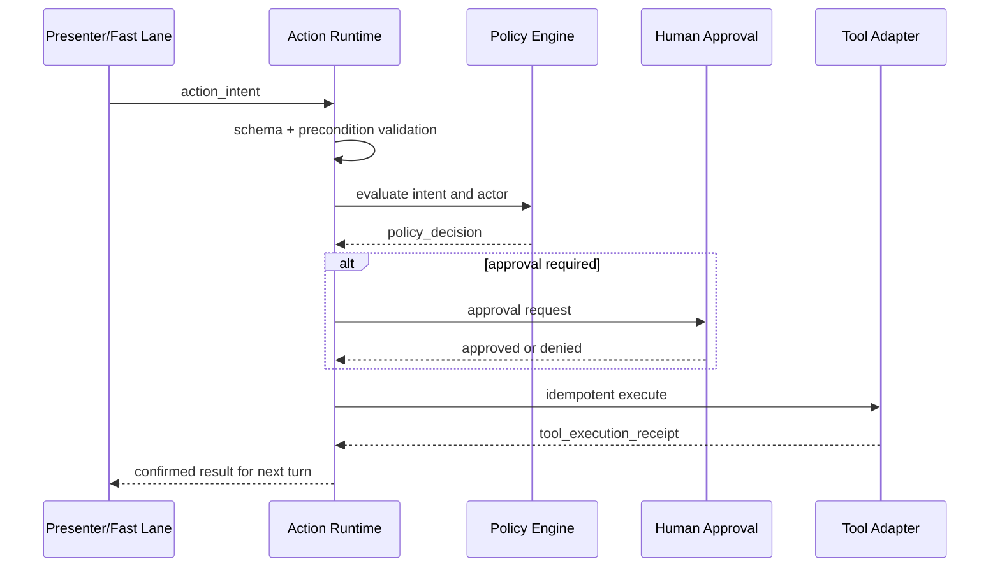

# Action and Tool Runtime

## Authority model

O LLM não possui autoridade. Ele produz `action_intent`. O runtime resolve policy e executa adapters.

## Pipeline

## Risk classes

| Classe | Exemplo | Default |
|---|---|---|
| read_public | catálogo público | automático |
| read_tenant | CRM permitido | automático com audit |
| read_pii | contato | scope e purpose |
| write_low | criar tarefa | automático configurável |
| write_high | enviar proposta, agendar externo | confirmação ou approval |
| financial | cobrança, desconto excepcional | approval e limites |
| irreversible | apagar, cancelar contrato | humano obrigatório |

## Idempotência

Todo write usa `idempotency_key` derivada de tenant, intent, target e logical attempt. Retry retorna o receipt anterior quando o efeito já ocorreu.

## State reduction

Somente receipt `succeeded` pode confirmar efeito. `accepted` ou `pending` atualiza estado para pendente. Timeout resulta `unknown`, exige reconciliação antes de retry cego.

## Secrets

Adapters recebem secret handles do secret broker. O modelo, logs e state não recebem secret values.

## Tool sandbox

- allowlist de egress;
- schema validation;
- request/response size limit;
- timeout;
- circuit breaker;
- redaction;
- rate and budget limit;
- audit hash.
