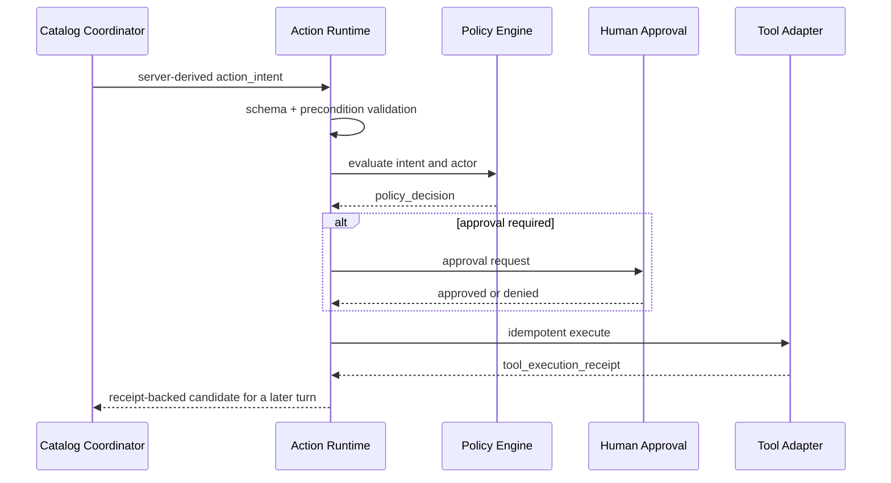

# Action and Tool Runtime

## Authority model

O LLM não possui autoridade. Ele produz `action_intent`. O runtime resolve policy e executa adapters.

## Pipeline

## Risk classes

| Classe | Exemplo | Default |
|---|---|---|
| read_public | catálogo público | automático |
| read_tenant | CRM permitido | automático com audit |
| read_pii | contato | scope e purpose |
| write_low | criar tarefa | automático configurável |
| write_high | enviar proposta, agendar externo | confirmação ou approval |
| financial | cobrança, desconto excepcional | approval e limites |
| irreversible | apagar, cancelar contrato | humano obrigatório |

## Idempotência

Todo write usa `idempotency_key` derivada de tenant, intent, target e logical attempt. Retry retorna o receipt anterior quando o efeito já ocorreu.

### Perfil de execução M0

M0 usa uma fixture de catálogo determinística dentro de `@axtro/tool-runtime`. Ela é privada, somente leitura, com contrato e argumentos em allowlist fechada. Não é um `ToolPort`, não recebe artefato de autorização do caller e não expõe adapter, callback, provider, endpoint ou credencial.

O runtime aceita somente contexto de request autenticado e `ActionIntent`. Ele cria o `PolicyDecision` e o `ToolExecutionReceipt`. Um intent negado produz receipt sem sucesso, exigência de approval produz receipt `pending`, e nenhum deles chega à fixture. Replay usa fingerprint canônico por tenant. Um resultado `unknown` bloqueia retry automático da mesma operação canônica, mesmo com nova chave de idempotência, até existir reconciliação.

O perfil de approval de M0 é uma opção fechada de composição que somente torna a policy mais restritiva para teste. Não é enviado pelo modelo nem deriva de `purpose`, argumentos ou receipt. A fixture padrão mantém o contrato `catalog.lookup` ativo: `tenant_installation`, `read_tenant`, `internal`, sem side effects e atores `presenter` ou `workflow`.

### Consulta explícita M1

M1-05 adiciona somente o `catalog_lookup_command` fechado e um coordenador
server-side fora do Turn Driver, Fast Lane, Session Actor, mídia e publicação
Presenter. O comando não aceita texto, tenant, ator, ferramenta, provider,
policy, receipt, key de idempotência, timeout ou resultado. O coordenador usa
o contexto autenticado e uma autoridade de sessão server-side para derivar um
`ActionIntent`, submetê-lo a Policy e retornar uma candidata baseada no
`ToolExecutionReceipt`.

Uma candidata só confirma disponibilidade quando o receipt é `succeeded`,
pertence ao tenant e intent derivados, tem resultado canônico e hash de efeito
correspondente. Ela cita os dados do próprio receipt, mas não grava timeline e
não produz fala automática. O modo fake de timeout é fechado na composição;
`unknown` bloqueia nova pergunta para a mesma operação até reconciliação
autenticada que determina `not_applied`. O `ToolPort` continua fechado.

Para composição com o console operacional, o coordenador oferece uma
capability separada de leitura bounded, derivada da cadeia imutável que ele
próprio já produziu. A leitura exige `session:read`, `essential_processing` e
tenant e sessão registrados, e retorna somente metadata allowlisted do intent,
policy e receipt. Ela não expõe argumentos, resultado, erro, provider, comando,
runtime, execução, reconciliação, publicação, timeline ou adapter.

## State reduction

Somente receipt `succeeded` pode confirmar efeito. `accepted` ou `pending` atualiza estado para pendente. Timeout resulta `unknown`, exige reconciliação antes de retry cego.

## Secrets

Adapters recebem secret handles do secret broker. O modelo, logs e state não recebem secret values.

## Tool sandbox

- allowlist de egress;
- schema validation;
- request/response size limit;
- timeout;
- circuit breaker;
- redaction;
- rate and budget limit;
- audit hash.
