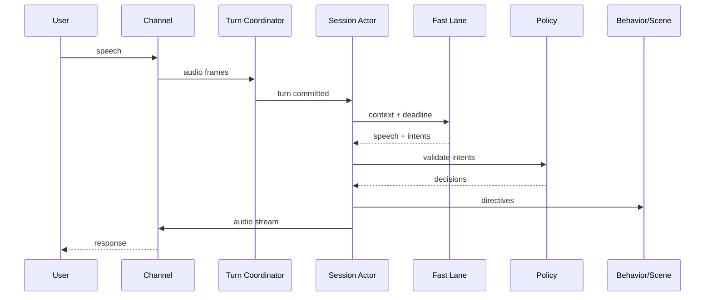
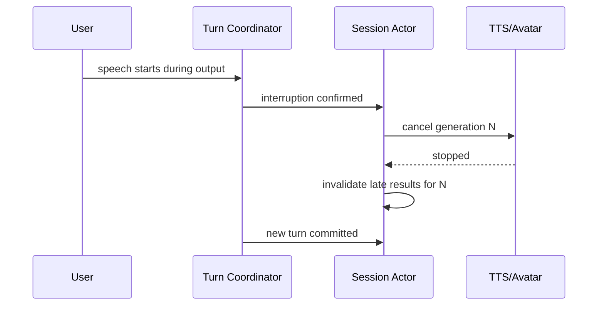
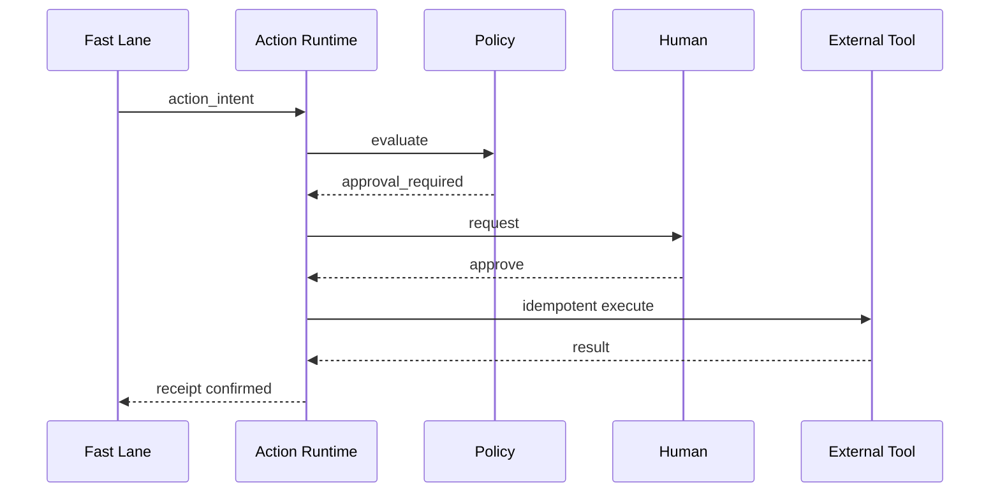
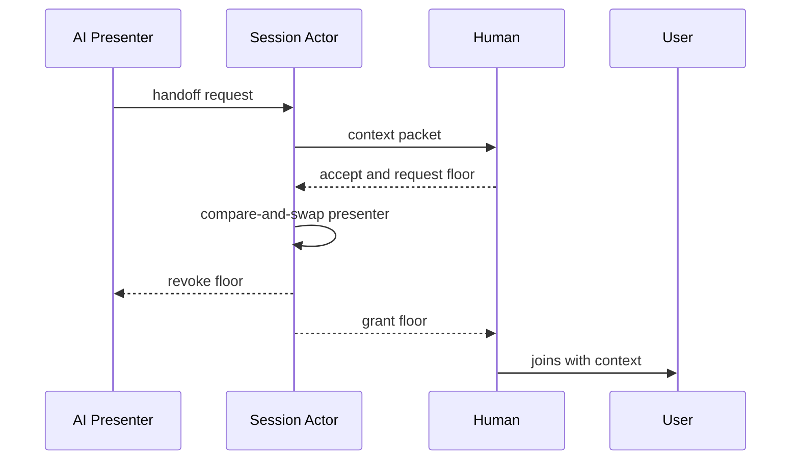
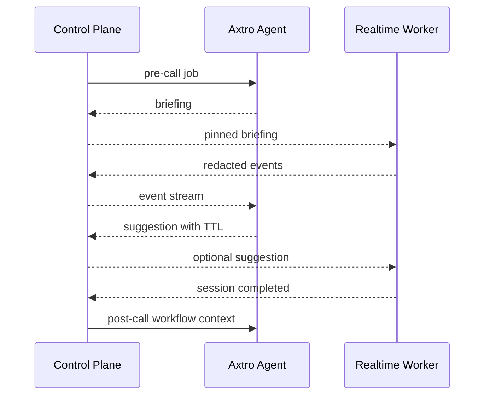

# End-to-end Sequence Diagrams

## Turno normal

```mermaid
sequenceDiagram
  participant U as User
  participant C as Channel
  participant T as Turn Coordinator
  participant S as Session Actor
  participant F as Fast Lane
  participant P as Policy
  participant B as Behavior/Scene
  U->>C: speech
  C->>T: audio frames
  T->>S: turn committed
  S->>F: context + deadline
  F-->>S: speech + intents
  S->>P: validate intents
  P-->>S: decisions
  S->>B: directives
  S->>C: audio stream
  C-->>U: response
```

## Barge-in

```mermaid
sequenceDiagram
  participant U as User
  participant T as Turn Coordinator
  participant S as Session Actor
  participant V as TTS/Avatar
  U->>T: speech starts during output
  T->>S: interruption confirmed
  S->>V: cancel generation N
  V-->>S: stopped
  S->>S: invalidate late results for N
  T->>S: new turn committed
```

## Tool write

```mermaid
sequenceDiagram
  participant F as Fast Lane
  participant A as Action Runtime
  participant P as Policy
  participant H as Human
  participant X as External Tool
  F->>A: action_intent
  A->>P: evaluate
  P-->>A: approval_required
  A->>H: request
  H-->>A: approve
  A->>X: idempotent execute
  X-->>A: result
  A-->>F: receipt confirmed
```

## Handoff quente

```mermaid
sequenceDiagram
  participant AI as AI Presenter
  participant A as Session Actor
  participant H as Human
  participant U as User
  AI->>A: handoff request
  A->>H: context packet
  H-->>A: accept and request floor
  A->>A: compare-and-swap presenter
  A-->>AI: revoke floor
  A-->>H: grant floor
  H->>U: joins with context
```

## Axtro Agent

```mermaid
sequenceDiagram
  participant CP as Control Plane
  participant AX as Axtro Agent
  participant RT as Realtime Worker
  CP->>AX: pre-call job
  AX-->>CP: briefing
  CP-->>RT: pinned briefing
  RT-->>CP: redacted events
  CP-->>AX: event stream
  AX-->>CP: suggestion with TTL
  CP-->>RT: optional suggestion
  RT-->>CP: session completed
  CP->>AX: post-call workflow context
```
