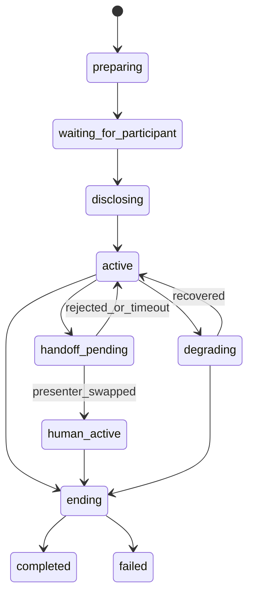

# Realtime Interaction Kernel

## Objetivo

Manter uma sessão viva, responsiva e cancelável enquanto separa media, decisão, estado e efeitos.

## Componentes

### Session Actor
Um actor por sessão. Processa comandos serialmente e publica snapshots. Mantém:
- session phase;
- `active_presenter_id`;
- conversation and role state;
- current turn generation;
- cancel tokens;
- provider session handles;
- short-lived suggestions and hypotheses;
- health and degradation mode.

### Mailbox
Prioridades:
1. safety stop e session terminate;
2. participant speech started e barge-in;
3. provider failure;
4. turn finalization;
5. action receipts;
6. suggestions e background updates.

Mailbox possui limite. Em backpressure, partial transcripts e sinais superseded são descartados antes de eventos finais.

### Context Composer
Compõe contexto para o Fast Lane a partir de:
- Constituição reduzida e role instructions;
- resumo de estado;
- últimos turnos relevantes;
- knowledge snippets com provenance;
- policy hints sem segredos;
- specialist results ainda válidos.

Nunca injeta raw logs, documentos inteiros ou resultados expirados.

Na implementação M1, o Composer é estritamente local e síncrono. Ele usa o
snapshot opaco do estado confirmado já projetado, trata o resumo incremental e
conhecimento como conteúdo não confiável, exclui `system_observation` sem
prova de consentimento, descarta sugestões tardias por `context_version` e
TTL, e entrega `context_composition` bounded ao Fast Lane fora da mailbox. Não
há RAG, cache, provider, ferramenta, mídia ou Axtro Agent síncrono neste caminho.

### Response Orchestrator
Recebe proposta do Fast Lane e divide:
- fala candidata;
- action intents;
- behavior intent;
- scene intent;
- state patches propostos.

Valida cada saída separadamente. Falha em scene não cancela fala; falha em action não pode ser mascarada.

## State machine



## Concurrency rules

- Cada geração recebe `turn_generation_id` monotônico.
- Áudio e cena publicados precisam carregar o generation id.
- Barge-in cancela todas as operações da geração corrente.
- Resultado tardio é ignorado se generation id não é atual.
- Action receipts podem atualizar estado após cancelamento, mas nunca disparar fala automática sem novo turno validado.
- Handoff usa compare-and-swap sobre `active_presenter_id`.

## Recovery

Snapshot é persistido após eventos de domínio relevantes, não após cada partial. Em crash:
1. obter lease da sessão;
2. carregar último snapshot;
3. aplicar timeline posterior;
4. reconciliar receipts em estado unknown;
5. reconectar canal se suportado;
6. informar degradação ou encerrar de forma segura.

## Interfaces mínimas

```python
class SessionActor:
    async def handle(self, command: SessionCommand) -> list[DomainEvent]: ...
    async def cancel_generation(self, generation_id: str, reason: str) -> None: ...
    async def snapshot(self) -> InteractionSessionState: ...

class ChannelAdapter:
    async def join(self, session_config): ...
    async def publish_audio(self, frame, generation_id): ...
    async def publish_video(self, frame, generation_id): ...
    async def stop_output(self, generation_id): ...
    async def close(self, reason): ...
```

## SLOs do kernel

- nenhuma operação sem timeout;
- shutdown gracioso ≤5 s;
- lease renovado sem bloquear turnos;
- mutation de estado sem I/O dentro da seção crítica;
- zero tarefa órfã após session completed.
