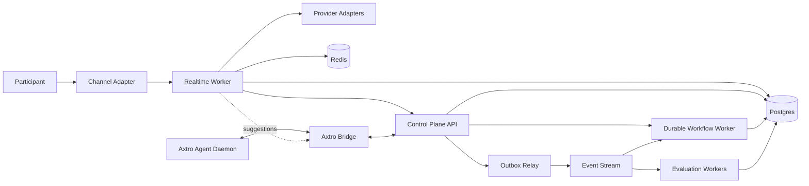

# System Architecture

## 1. Cinco planos

### Experience and Channel Plane
Interfaces com participantes: Sala Axtro, widget, telefone e meeting bots. Não contém regra de negócio.

### Realtime Interaction Plane
Session Actor, Turn Coordinator, media pipeline, Context Composer, Behavior Director e Scene Director. Otimizado para baixa latência e cancelamento.

### Intelligence and Role Plane
Cognitive Fabric, Role State, Role Packs, Skill Packs, Knowledge e Specialist Fabric. Produz propostas tipadas, não efeitos externos diretos.

### Control and Workflow Plane
API SaaS, tenant config, provider registry, Axtro Agent bridge, workflows duráveis, billing, approvals e administração.

### Data, Governance and Evaluation Plane
Postgres, object storage, cache, outbox, audit ledger, observabilidade, consentimentos, políticas, evals e Learning Lab.

## 2. Topologia de containers

## 3. Processos iniciais

| Processo | Linguagem recomendada | Responsabilidade | Escala |
|---|---|---|---|
| `apps/web` | TypeScript SSR framework-neutral em M1; shell Next.js opcional depois de browser auth | console, sala, administração | request based |
| `apps/api` | TypeScript/NestJS ou Fastify modular | Control Plane e APIs | stateless |
| `apps/realtime-worker` | Python/LiveKit Agents | Session Actor e media loop | por sessão/job |
| `apps/event-relay` | TypeScript determinístico | claim bounded do outbox e consumer idempotente da timeline | uma tentativa por job |
| `apps/axtro-supervisor` | Python | bridge com daemon e jobs assistivos | workers |
| `apps/meeting-bot-worker` | TypeScript ou Python | lifecycle de meeting bots | por bot |
| workflow worker | TypeScript ou Python | timers, retries e compensação | queue workers |

## 4. Fronteiras de sincronismo

### Permitido no caminho crítico
- VAD e turn detector local/provider.
- Fast Lane LLM ou Realtime model.
- leitura curta de estado local.
- policy read-only em memória/cache.
- tool read-only com timeout estrito quando indispensável.
- TTS, avatar e publicação de mídia.

### Sempre assíncrono ou opcional
- Axtro Agent.
- Deliberative Lane.
- especialistas profundos.
- avaliação e coaching.
- ingestão RAG.
- CRM pós-call e follow-up.
- Learning Lab.

## 5. Unidade de isolamento realtime

Cada sessão possui um **Session Actor** lógico com mailbox serializada. Eventos concorrentes chegam à mailbox, mas mutações de estado são aplicadas em ordem. Operações longas recebem cancel tokens e nunca seguram o lock do estado.

## 6. Dados de verdade

- Configuração: Postgres.
- Estado quente: memória do Session Actor com snapshot em Redis/Postgres.
- Timeline: append-only em Postgres via outbox.
- Efeitos externos: `tool_execution_receipt`.
- Regras: policy bundle versionado.
- Conteúdo: knowledge versionado com source metadata.

## 7. Estratégia de implantação

M0-M3: monólito modular no Control Plane, workers separados por runtime. Containers devem ser portáveis e sem dependência de filesystem local. Produção inicial em uma região próxima do público principal; media edge é responsabilidade do provider realtime.

## 8. Critérios de extração futura

Um módulo vira serviço apenas quando pelo menos um ocorrer:
- perfil de escala independente;
- boundary de segurança específico;
- runtime incompatível;
- blast radius inaceitável;
- necessidade de deploy independente comprovada.
