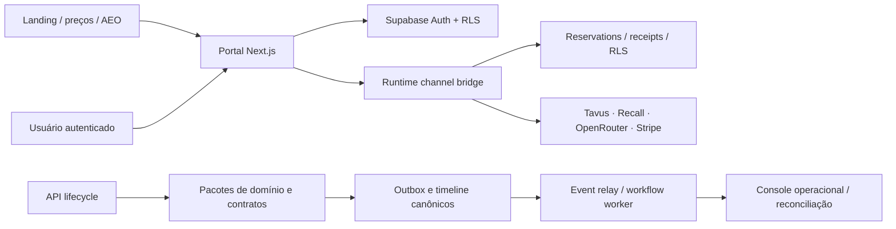

# Mapa factual do sistema

**Atualizado em:** 2026-08-18  
**Escopo:** auditoria 360 e a tarefa ativa M5-03. Este mapa descreve o que está no repositório; não confirma a configuração de ambientes externos.

## Produto e fluxos de valor

O Axtro Digital Human OS é uma plataforma multi-tenant para operar apresentadores digitais em vendas, onboarding e customer success. O primeiro Role Pack é o Sales Closer Alpha. A proposta de valor é combinar presença em vídeo, conhecimento autorizado, políticas, evidências e receipts sem afirmar resultado comercial ou ação externa sem confirmação durável.

Os fluxos relevantes são:

1. Visitante público: landing → demonstração compartilhada com dados fictícios ou login/criação de conta → workspace.
2. Operador autenticado: workspace → agente/conhecimento/configuração → conversa, apresentação ou fluxo de cobrança governado.
3. Canal pago: identidade de servidor → bridge de runtime → disclosure e consentimento por finalidade → grant de uso único → reservation M5-01 → provider → receipt imutável.
4. Pós-conversa: eventos canônicos → outbox → workflow/reconciliação → superfícies de operação, sempre com fronteira tenant e escopos explícitos.

## Monorepo e limites de módulo

| Área | Responsabilidade factual | Limite importante |
| --- | --- | --- |
| `apps/portal` | Next.js App Router, ações de servidor, páginas públicas/autenticadas, billing, adapters de provider e `/api/*`. | Proteção no cliente não substitui RLS/RPC. |
| `apps/api` | Adaptadores framework-neutral de ciclo de sessão, autenticação e ingress seguro. | Tenant é resolvido de contexto assinado, não de header livre. |
| `apps/event-relay` | Entrega idempotente de outbox e DLQ PII-free. | Não confirma efeito sem receipt. |
| `apps/workflow-worker` | Trabalho assíncrono pós-conversa. | Draft e envio externo continuam separados. |
| `apps/realtime-worker` | Primitivas Python de runtime determinístico. | Ainda não é a fronteira de mídia de produção. |
| `apps/meeting-room` | Normalização de transporte/sala. | Não decide políticas, tenant ou Presenter. |
| `apps/web` | Console operacional de read model. | Trata texto/evidência como não confiáveis. |
| `packages/*` | Domínio, auth, config, security, observability, RAG, scene director e degradação. | Kernel não importa SDK de provider. |
| `contracts/` | JSON Schemas, OpenAPI/AsyncAPI, exemplos e tipos gerados. | Contratos são a fronteira de compatibilidade. |

## Dados, isolamento e evidência

- O banco local usa migrations `database/migrations/0001`–`0012`; o conjunto Supabase-only contém extensões de rollout até `0044`.
- `app.uuid_v7` é a fronteira para identificadores persistidos pelo servidor. UUID externo é permitido apenas como correlação opaca de comando e é fingerprinted antes da idempotência.
- RLS forçada, chaves compostas tenant/recurso e RPCs de service role protegem sessões, grants, reservations, receipts, consent/disclosure e outbox.
- A versão local esperada de capability é **v44**. A migration `0044` é forward-only, ainda exige aplicação humana e mantém o bridge fail-closed até que `/api/ready` e o bootstrap vejam a capability.
- Fontes de conhecimento, transcript, timeline, receipts e logs contêm dados potencialmente sensíveis. Telemetria deve usar `apps/portal/src/lib/telemetry.ts`, nunca `console.*` diretamente.

## Autorização e integrações

| Integração | Papel no código | Controle observado |
| --- | --- | --- |
| Supabase | Auth, Postgres, RLS e RPCs. | Contexto tenant/actor assinado; readiness valida schema. |
| Tavus / Recall | Vídeo e reunião externa. | Provider depende de grant, reservation e receipt. |
| OpenRouter | Geração/modelos. | Adapter separado e orçamento/reservation. |
| Stripe | Assinatura e overage. | Checkout/webhook e outbox de uso reconciliado. |
| Resend | E-mail transacional/alerta. | Sem envio a partir do modelo. |
| Railway | Hospedagem documentada. | Não foi alterada nem consultada nesta auditoria. |

## Superfícies públicas, CI e operação

`/`, `/precos`, `/termos` e `/privacidade` são indexáveis com canonical no domínio `https://closer.axtroai.com`. Áreas autenticadas, auth e API são excluídas em `robots.txt`; `llms.txt` e `llms-full.txt` descrevem somente fatos públicos.

- `scripts/validate_all.py` agrega documentação, contratos, specs, banco, migrações, dependências e segredos.
- `pnpm test` executa Node/Python; Playwright é um gate separado. O E2E autenticado depende da demo, enquanto o novo E2E público não depende de credencial.
- `scripts/supabase-portal-integration.mjs` monta PostgreSQL local e verifica RLS, grants, One Mouth, reservations, receipts e capabilities.
- O rollout de provider é humano e observável: feature flags ficam desligadas até canário, readiness e receipts confirmados.

## Limite atual de promoção

O repositório tem mecanismos determinísticos de turno e cancelamento, mas Tavus/Recall ainda não provam uma fronteira de mídia de produção com geração, cancelamento e descarte de saída tardia end-to-end. Isso bloqueia promoção realtime; landing e migration não resolvem esse risco.
