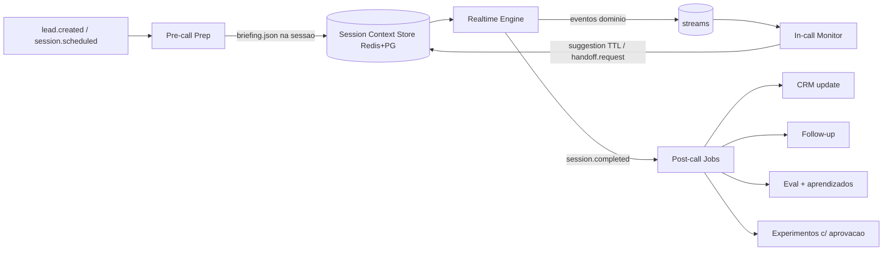

# AXTRO_AGENT_INTEGRATION — O Gerente Autônomo (Hermes daemon)

Fato confirmado: o **Axtro Agent já existe**, roda 24/7 sobre o engine **Hermes (Nous Research)**. Este documento define como ele governa a operação **sem entrar no caminho crítico** da conversa (ADR-012).

## Princípios
1. O Realtime Engine **nunca espera** o daemon. 2. Comunicação exclusivamente **assíncrona por eventos** (Redis Streams; NATS na Fase 3+). 3. Toda ação do daemon com efeito externo passa pelo **Tool Runtime** (mesmos contratos, mesmas permissões, actor=`axtro_agent`). 4. Sugestões in-call têm **TTL** e são conselho, não comando. 5. Daemon indisponível ⇒ zero impacto além de "menos inteligência auxiliar".

## Ciclo

## Antes da reunião (job `precall.prepare`, deadline: até 2min antes; senão default)
Entradas: lead, fontes permitidas (CRM, site, enriquecimento autorizado), agenda. Saída = **Briefing v1** (schema `briefing.schema.json`): segmento, estágio do lead (4 tipos Silva), closer especializado escolhido (agent_version), estratégia (metodologia+ênfases), materiais sugeridos (IDs), objeções prováveis com respostas do quadro do tenant, tools autorizadas (subset), políticas/limites da sessão, contexto inicial (3 fatos + 1 gancho). Guardrails: só dados permitidos; nada inventado (campos `confidence`), tudo citável.

## Durante a reunião (Monitor)
Consome: intent/objection/sentiment/tool.failed/turn.metrics/compliance.*. Produz apenas: `supervisor.suggestion {text≤160ch, kind: reformular|material|proximo_passo|alerta_risco, ttl_turns:2}` e `supervisor.handoff_request {reason}` — entregues pelo canal `session:{id}:control`, injetadas como nota de sistema **entre turnos**. Proibições explícitas: responder frases do cliente, alterar limites, chamar tools de escrita durante a call, qualquer chamada síncrona ao Realtime. SLO do monitor: reação ≤5s (não afeta a fala).

## Depois da reunião (jobs idempotentes, outbox)
resumo executivo + decisões → `crm.update_opportunity` + `crm.log_activity` → tarefas → proposta (draft p/ aprovação quando exigido) → follow-up (Reunião Silva: próximo passo com data) → análise de objeções (agrega no quadro do tenant) → avaliação da call (dispara eval assíncrono) → métricas → **aprendizados** (memória de aprendizado, agregada/anonimizada) → propostas de melhoria de script/prompt = **experimento** com aprovação humana e gate de eval antes de ativar (nunca hot-patch em produção).

## Segurança do daemon
Identidade de serviço própria, escopos mínimos por tenant, budget de tokens/dia, kill switch dedicado (`supervisor.pause tenant|global`), replay-safe (event_id dedup), logs sem PII bruta. O daemon lê RAG/transcripts como **dado não confiável** — prompt injection vindo de conteúdo de call não pode virar ação (mesmas defesas do TOOL_RUNTIME).

## Interface com o Hermes
Wrapper `apps/axtro-supervisor` expõe ao Hermes um conjunto de **skills tipadas** (prepare_briefing, monitor_session, postcall_pipeline, propose_experiment) — o loop de planejamento do Hermes decide *quando/como*, os contratos decidem *o que é permitido*. Versionar o wrapper independentemente do engine.
