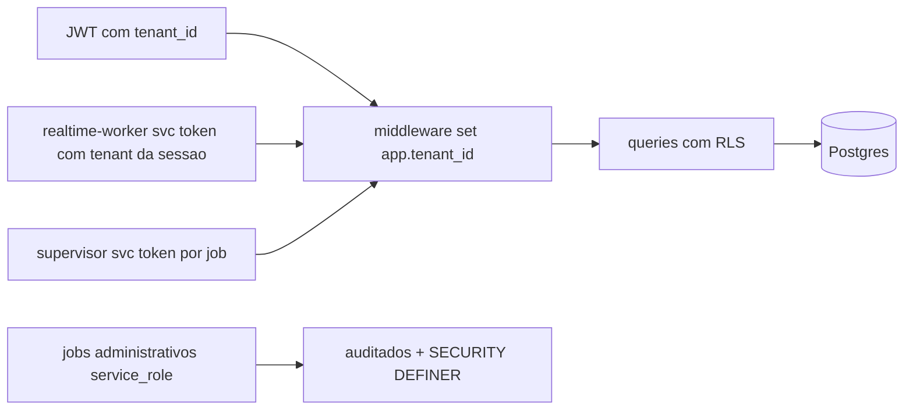

# DATA_MODEL — Postgres (Supabase) com RLS

DDL de referência (migrations reais em `packages/database/migrations`, geradas na Fase 0). Convenções: uuid v7 PK · `tenant_id` NOT NULL + RLS · `created_at/updated_at` timestamptz · soft-delete só onde exigido por retenção · enums via CHECK (evita lock de ALTER TYPE).

## Núcleo (F0–F1)
```sql
create table tenants (
  id uuid primary key default gen_random_uuid(),
  slug text unique not null, name text not null,
  region text not null default 'br', locale text not null default 'pt-BR',
  currency text not null default 'BRL', timezone text not null default 'America/Sao_Paulo',
  plan text not null default 'starter', status text not null default 'active',
  branding jsonb not null default '{}', retention jsonb not null default '{"recordings_days":90,"transcripts_days":365}',
  created_at timestamptz default now(), updated_at timestamptz default now());

create table users (id uuid primary key, email citext unique not null, name text, mfa_enabled bool default false, created_at timestamptz default now());
create table memberships (
  tenant_id uuid not null references tenants(id), user_id uuid not null references users(id),
  role text not null check (role in ('owner','admin','manager','agent_operator','viewer')),
  attrs jsonb not null default '{}', primary key (tenant_id, user_id));

create table agents (
  id uuid primary key default gen_random_uuid(), tenant_id uuid not null,
  name text not null, role text not null check (role in ('sdr','closer','demo','onboarding','followup','recovery','cs','qualifier','supervisor','coach','analyst','compliance')),
  status text not null default 'draft', active_version_id uuid, created_at timestamptz default now());
create table agent_versions (
  id uuid primary key default gen_random_uuid(), tenant_id uuid not null, agent_id uuid not null references agents(id),
  version int not null, persona jsonb not null, voice jsonb not null, avatar jsonb, languages text[] not null default '{pt-BR}',
  methodology text not null default 'metodo_silva', methodology_config jsonb not null default '{}',
  system_prompt text not null, pronunciation_glossary jsonb not null default '[]',
  tool_grants jsonb not null default '[]', limits jsonb not null default '{"max_discount_pct":0}',
  handoff_rules jsonb not null default '{}', disclosure_text jsonb not null,  -- por idioma
  eval_status text not null default 'pending' check (eval_status in ('pending','passed','failed')),
  created_by uuid, created_at timestamptz default now(), unique (agent_id, version));

create table leads (
  id uuid primary key default gen_random_uuid(), tenant_id uuid not null,
  contact jsonb not null,            -- nome, email, telefone (PII: cripto app-level nos campos marcados)
  company jsonb, source text, lead_type text check (lead_type in ('hot','warm','cold_open','cold_closed')),
  consent jsonb not null default '{}',  -- opt-in canais, DNC flags, timestamps
  owner_user_id uuid, status text not null default 'new', created_at timestamptz default now());
create table opportunities (
  id uuid primary key default gen_random_uuid(), tenant_id uuid not null, lead_id uuid not null references leads(id),
  stage text not null default 'qualification', amount numeric, currency text default 'BRL',
  probability numeric, silva_handoff jsonb,   -- 8 campos do Metodo Silva
  next_step text, next_step_at timestamptz, lost_reason text, updated_at timestamptz default now());

create table sessions (
  id uuid primary key default gen_random_uuid(), tenant_id uuid not null, agent_version_id uuid not null,
  lead_id uuid, opportunity_id uuid, channel text not null check (channel in ('native_room','widget','phone','gmeet','zoom','teams','api')),
  mode text not null default 'pipeline' check (mode in ('pipeline','s2s')),
  status text not null default 'preparing' check (status in ('preparing','ready','live','handoff','completed','failed','dropped')),
  briefing jsonb, started_at timestamptz, ended_at timestamptz, recording_url text,
  cost_cents int, minutes numeric, metrics jsonb not null default '{}', created_at timestamptz default now());

create table session_state (session_id uuid primary key references sessions(id), tenant_id uuid not null,
  state jsonb not null, state_rev int not null default 0, updated_at timestamptz default now());
create table session_state_revisions (id bigserial primary key, tenant_id uuid not null, session_id uuid not null,
  state_rev int not null, patch jsonb not null, actor text not null, created_at timestamptz default now());
create table transcripts (id bigserial primary key, tenant_id uuid not null, session_id uuid not null,
  turn int not null, speaker text not null check (speaker in ('agent','customer','human_rep','system')),
  text text not null, source_refs jsonb, ts_start_ms int, ts_end_ms int, created_at timestamptz default now());

create table handoffs (id uuid primary key default gen_random_uuid(), tenant_id uuid not null, session_id uuid not null,
  reason text not null, packet jsonb not null, requested_at timestamptz default now(), accepted_by uuid, accepted_at timestamptz,
  completed_at timestamptz, outcome text);
create table followups (id uuid primary key default gen_random_uuid(), tenant_id uuid not null, lead_id uuid,
  session_id uuid, kind text not null, due_at timestamptz not null, payload jsonb not null,
  status text not null default 'pending' check (status in ('pending','approved','sent','done','canceled')), created_at timestamptz default now());
```

## Conhecimento, tools, eventos, uso
```sql
create table knowledge_sources (id uuid primary key default gen_random_uuid(), tenant_id uuid not null,
  kind text not null, title text not null, uri text, doc_version int not null default 1, language text default 'pt-BR',
  product_ids uuid[] default '{}', valid_from date, valid_until date, acl_roles text[] default '{}',
  checksum text, status text not null default 'active', created_at timestamptz default now());
create table knowledge_chunks (id bigserial primary key, tenant_id uuid not null, source_id uuid not null references knowledge_sources(id),
  doc_version int not null, chunk_ix int not null, content text not null, tokens int,
  embedding vector(1536), tsv tsvector generated always as (to_tsvector('portuguese', content)) stored,
  contact_refs uuid[] default '{}', metadata jsonb not null default '{}');
create index on knowledge_chunks using hnsw (embedding vector_cosine_ops);
create index on knowledge_chunks using gin (tsv);

create table tools (name text, version text, tenant_id uuid, contract jsonb not null, enabled bool default true,
  primary key (tenant_id, name, version));
create table tool_grants (tenant_id uuid not null, agent_id uuid not null, tool_name text not null,
  field_allowlist jsonb, limits jsonb, primary key (tenant_id, agent_id, tool_name));
create table tool_executions (id uuid primary key default gen_random_uuid(), tenant_id uuid not null,
  session_id uuid, actor text not null, tool_name text not null, idempotency_key text,
  args_redacted jsonb not null, result_redacted jsonb, status text not null, error text,
  duration_ms int, cost_cents int, trace_id text not null, created_at timestamptz default now(),
  unique (tenant_id, tool_name, idempotency_key));

create table integrations (id uuid primary key default gen_random_uuid(), tenant_id uuid not null,
  provider text not null, status text not null default 'connected', config jsonb not null default '{}',
  secret_ref text not null,  -- referencia ao Vault, nunca o segredo
  created_at timestamptz default now(), unique (tenant_id, provider));
create table phone_numbers (id uuid primary key default gen_random_uuid(), tenant_id uuid not null,
  e164 text unique not null, provider text default 'telnyx', routing jsonb not null default '{}', hours jsonb);

create table outbox_events (id bigserial primary key, tenant_id uuid, event_id uuid not null unique,
  event_type text not null, schema_version text not null, occurred_at timestamptz not null,
  payload jsonb not null, published_at timestamptz);
create table usage_meters (tenant_id uuid not null, day date not null, dimension text not null,
  qty numeric not null default 0, cost_cents int not null default 0, primary key (tenant_id, day, dimension));
create table audit_log (id bigserial primary key, tenant_id uuid, actor text not null, action text not null,
  entity text, entity_id text, detail jsonb, trace_id text, created_at timestamptz default now());

create table evaluations (id uuid primary key default gen_random_uuid(), tenant_id uuid, subject text not null,
  subject_ref text not null, suite text not null, scores jsonb not null, passed bool not null,
  created_at timestamptz default now());
create table learnings (id uuid primary key default gen_random_uuid(), tenant_id uuid not null,
  kind text not null, aggregate jsonb not null, sample_n int not null, approved_by uuid, created_at timestamptz default now());
```

## RLS (padrão aplicado por migration helper a TODAS as tabelas acima)
```sql
alter table <t> enable row level security;
create policy tenant_isolation on <t>
  using (tenant_id = current_setting('app.tenant_id', true)::uuid)
  with check (tenant_id = current_setting('app.tenant_id', true)::uuid);
-- service_role: policy separada 'service_jobs' restrita a funcoes SECURITY DEFINER auditadas
```
Middleware (NestJS/psycopg): `set_config('app.tenant_id', $1, true)` por transação; proibido pool sem reset.

## Retenção e purga
Jobs diários: gravações > retention → delete storage + null recording_url; transcripts > retention → purge; direitos do titular → função `erase_contact(tenant, contact_id)` cascateando leads/transcripts (redação)/chunks com contact_refs/memórias. Backups: PITR Supabase 7d (F1) → 30d (F4); testes de restore trimestrais (DR em SECURITY §).

## Fluxo de dados multi-tenant

