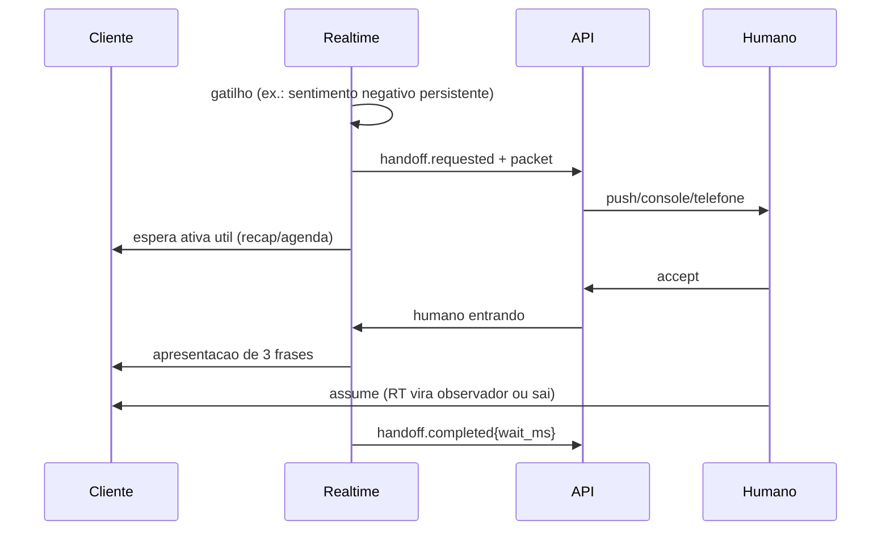
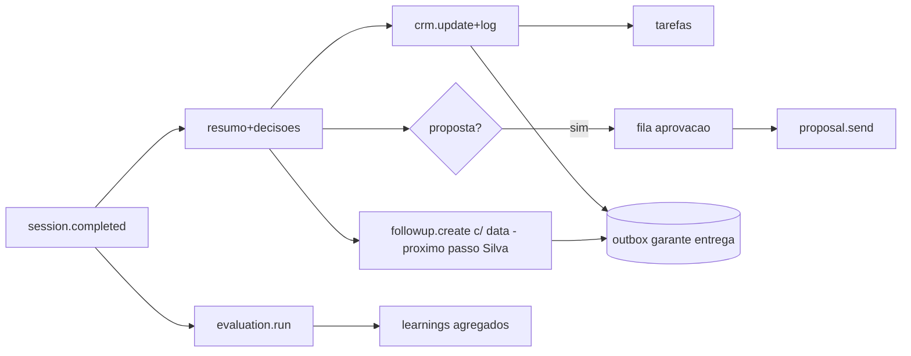
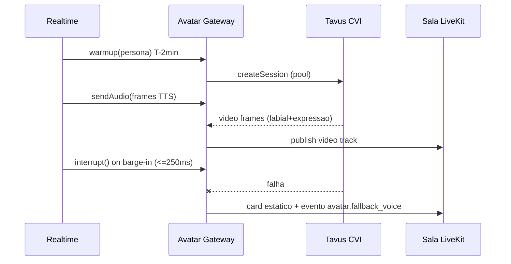
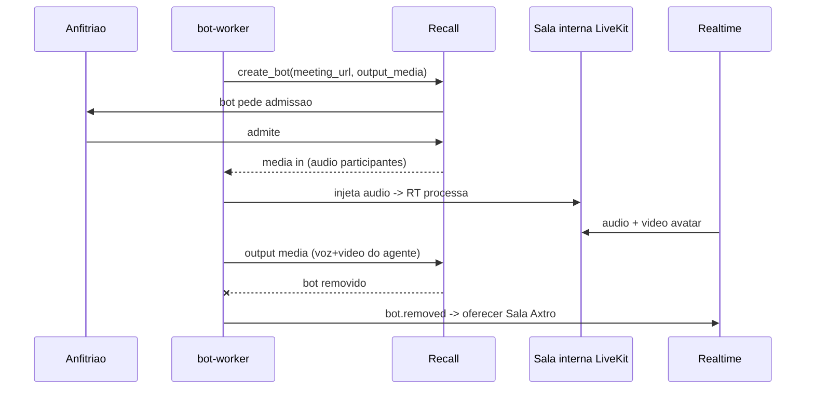
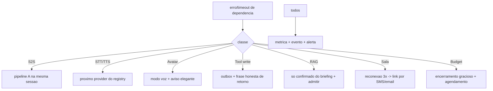
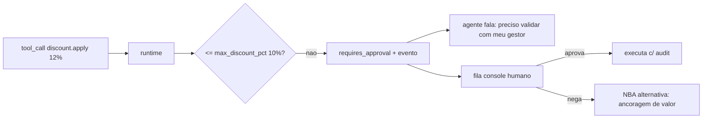

# DIAGRAMS — Índice + Fluxos Complementares (Mermaid)

Já publicados: contexto e containers (SYSTEM_ARCHITECTURE) · fluxo completo de call (SYSTEM_ARCHITECTURE) · máquina de turnos (REALTIME §3) · ciclo do Axtro Agent (AXTRO_AGENT_INTEGRATION) · ciclo do meeting bot (MEETING_GATEWAY) · pipeline de tools (TOOL_RUNTIME §3) · RAG (KNOWLEDGE §3) · outbox→bus (EVENT_ARCHITECTURE) · fluxo multi-tenant (DATA_MODEL). Abaixo, os restantes.

## Fluxo de preparação (pré-call)
```mermaid
sequenceDiagram
  participant API
  participant SUP as Axtro Agent
  participant KB as Knowledge
  participant PG as Postgres
  API->>SUP: session.preparing (lead_id)
  SUP->>PG: CRM + oportunidade + memoria cliente (recorte)
  SUP->>KB: materiais/objecoes do segmento
  SUP->>PG: grava briefing.json (schema briefing/1.0.0)
  Note over SUP: deadline T-2min; senao realtime usa local_default
```

## Fluxo de handoff


## Fluxo pós-call


## Fluxo de avatar (F2)


## Fluxo Zoom/Meet (F3)


## Fluxo de fallback (decisão em runtime)


## Fluxo de segurança (request de tool financeiro)

