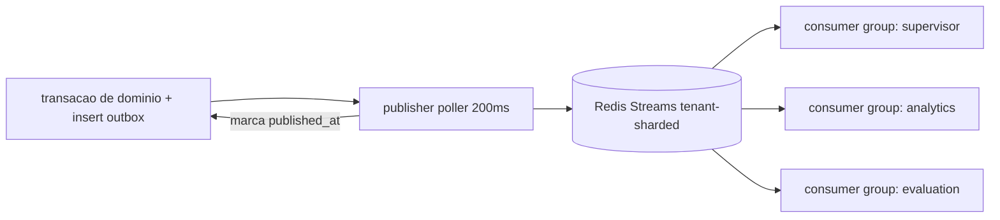

# EVENT_ARCHITECTURE — Espinha Dorsal Assíncrona (ADR-008)

## Decisão por fase (justificada)
- **F0–F2 (MVP): Postgres outbox + Redis Streams (Upstash).** Motivo: exactly-once efetivo via outbox+dedup, consumer groups nativos, zero ops, volume esperado <5k eventos/min. Kafka/NATS agora = overengineering.
- **F3+ (gatilho de migração):** >20k eventos/min sustentado, ou necessidade de retenção longa/replay multi-consumidor/multi-região → **NATS JetStream** (leve, subjects hierárquicos `tenant.{id}.session.{sid}.*`, ótimo p/ edge). Kafka só se warehouse streaming exigir. Interface `EventBus` em `packages/events` esconde o transporte — migração sem tocar produtores/consumidores.

## Envelope (schema `packages/domain/schemas/event_envelope.schema.json`)
```json
{"event_id":"uuid","event_type":"objection.detected","schema_version":"1.0.0",
 "occurred_at":"iso8601","tenant_id":"uuid","session_id":"uuid|null","trace_id":"w3c",
 "actor":{"type":"realtime|supervisor|api|bot|system","id":"..."},
 "correlation":{"lead_id":null,"opportunity_id":null,"agent_id":null},
 "data":{}}
```
Regras: eventos **imutáveis**; evolução por schema_version (aditivo em minor; breaking = novo major consumido em paralelo); consumidores idempotentes por event_id; PII em `data` minimizada (referências, não payloads de contato).

## Catálogo v1 (payload resumido)
| Evento | Produtor | data (chaves) |
|---|---|---|
| lead.created | api | lead_id, source, lead_type |
| session.preparing / session.ready | api / realtime | channel, agent_version_id / warmup_ms |
| participant.joined / participant.left | gateway | participant{role,name?} |
| speech.started / speech.ended | realtime | speaker, ts_ms |
| transcript.partial / transcript.final | realtime | turn, speaker, text(final) |
| intent.detected | realtime | intent, confidence |
| objection.detected | realtime | type, text_ref |
| sentiment.changed | realtime | from, to, trend |
| turn.metrics | realtime | eot_ms, ttft_ms, ttfb_ms, e2e_ms, interrupted |
| tool.requested / tool.completed / tool.failed | runtime | tool, risk_class, duration_ms, error? |
| presentation.opened / slide.changed | controller | material_id, slide_ix |
| proposal.generated | supervisor | proposal_id, requires_approval |
| payment.requested | runtime | link_id, amount, status |
| handoff.requested / handoff.completed | realtime/api | reason / accepted_by, wait_ms |
| session.completed / session.failed / session.dropped | realtime | duration, cost_cents, outcome / error |
| followup.created | supervisor | kind, due_at |
| crm.updated | runtime | entity, op |
| evaluation.completed | evaluation | suite, passed, scores_ref |
| compliance.ai_disclosed / compliance.recording_consent | realtime | locale / granted |
| budget.exceeded / bot.removed / security.prompt_probe | vários | dimensão / plataforma / snippet_hash |

## Fluxo outbox → bus

Garantias: at-least-once na entrega + idempotência no consumo = efetivamente once. DLQ: stream `dlq` com alerta após 5 tentativas. Retenção quente 7d; arquivamento em Postgres/warehouse.
