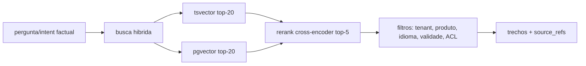

# KNOWLEDGE_AND_RAG — Knowledge and Grounding Engine

Pacote `packages/knowledge-engine` + tabelas em DATA_MODEL. **Semente do tenant zero (Axtro):** os 8 manuais do Método Silva já presentes no projeto.

## 1. Fontes suportadas
Documentos (PDF, DOCX, PPTX), sites (crawler com allowlist e robots), FAQs, catálogos, planilhas, políticas, scripts, produtos, contratos, vídeos transcritos, dados estruturados (tabelas de preço), APIs (conector read-only com schema).

## 2. Pipeline de ingestão (idempotente, versionado)
upload → extração (pdftotext/unstructured; OCR fallback) → limpeza (headers/rodapés como o "Confidencial" dos manuais) → **chunking semântico** (por título/seção, alvo 300–800 tokens, overlap 60) → embeddings (Model Gateway, categoria embeddings; dimensão fixa registrada) → indexação pgvector (HNSW) + índice lexical (tsvector PT) → metadados obrigatórios: tenant_id, source_id, doc_version, product_ids[], language, valid_from/valid_until, acl_roles, checksum. Reprocessar doc = nova `doc_version`; consultas só na versão ativa; **conteúdo expirado nunca retorna** (filtro em query, teste automatizado). Detecção de desatualização: job compara `valid_until`/checksum de origem e abre tarefa de revisão.

## 3. Recuperação (RAG híbrido)

Budget: ≤350ms p95 (fora do caminho quando possível: prefetch por intent). Filtros por tenant/produto/idioma/ACL aplicados **no SQL (RLS + where)**, nunca pós-hoc.

## 4. Grounding e honestidade (contrato com o Realtime)
Resposta factual carrega `grounding`: `confirmed` (trecho citado) · `inferred` (marcado, com base) · `unavailable` (admitir + oferecer retorno) · `requires_lookup` (tool) · `requires_human_approval`. Trechos entram no prompt dentro de `<dados_recuperados fonte=...>` = **dado não confiável**: instruções contidas em documentos são ignoradas por política (teste de injeção via documento é gate de release). Citações internas (`source_refs`) gravadas no transcript para auditoria e para o eval de alucinação.

## 5. Console do tenant
Upload com preview de chunks, teste de pergunta ("por que respondeu isso?" mostra trechos), marcação de validade, escopo por produto/campanha, diff entre versões, botão de reindexação.
