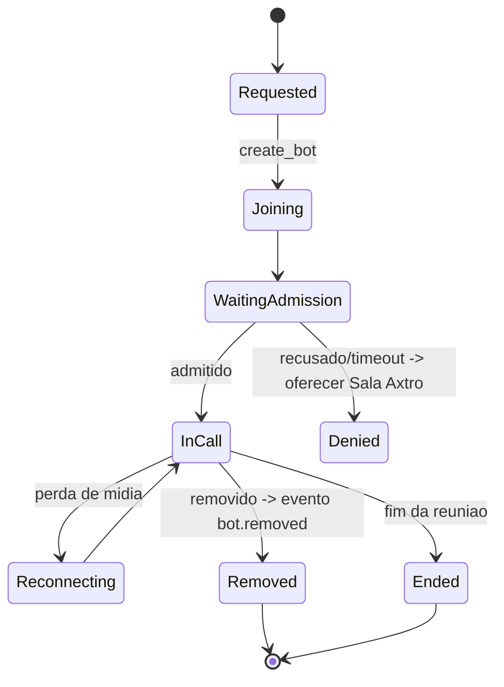

# MEETING_GATEWAY — Canais de Entrada

Camada `packages/meeting-gateway` + `apps/meeting-bot-worker`. Interface única `ChannelAdapter` (join, leave, publish_audio, publish_video, publish_content, subscribe_media, participants, lifecycle_events, capabilities). Cada canal declara `capabilities` (video_out, screen_share, dtmf, chat, recording...) e o Realtime Engine se adapta.

## Adapters
| Canal | Fase | Implementação | Notas |
|---|---|---|---|
| **Axtro Native Room** | F1 | LiveKit Cloud (ADR-003) | áudio, vídeo, chat, avatar, humanos, screen-share, gravação (egress), legendas, apresentações, demonstração, handoff; co-browsing = extensão futura do Presentation Engine |
| Web widget | F1 | mesmo LiveKit, embed JS `<script>` com token curto | modo voz por padrão; vídeo opcional |
| Telefonia (Telnyx) | F1.5 | LiveKit SIP trunk ↔ Telnyx (conta existente) | inbound/outbound c/ consentimento, DTMF, gravação c/ aviso, voicemail detection (Telnyx AMD), horários por tenant, filas, números por empresa, webhooks assinados, SMS de follow-up |
| Google Meet / Zoom / Teams | F3 | `MeetingBotProvider` = **Recall.ai** (ADR-006) com **Output Media** (publica áudio + vídeo do avatar); ponte de mídia bot↔sala LiveKit interna onde roda o agente | entrar como participante, aguardar admissão, identificar participantes (diarização + roster), compartilhar conteúdo quando a plataforma suportar; senão, link do material no chat |
| Aplicativo móvel | F4 | mesmo widget via WebView/PWA | |
| API de terceiros | F4 | REST/Webhooks p/ criar sessões e receber eventos | |

## Ciclo de vida do meeting bot (normativo)

Eventos emitidos: bot.requested/joining/waiting/admitted/denied/removed/reconnected/ended + participant.joined/left + media.audio_in/out. Reentrada só quando permitido pela plataforma e pelo host (política por tenant). Substituição futura do provider: contratos em `provider-contracts/meeting-bot.ts`; nada fora deles.

## Regras transversais
- Identificação de IA no início vale para **todos** os canais (voz no telefone; voz+nome no Meet/Zoom; banner+voz no widget).
- Gravação: sempre com aviso conforme COMPLIANCE (config por região); Meet/Zoom respeitam indicadores nativos da plataforma.
- Handoff por canal: sala nativa = humano entra; telefone = transferência SIP; Meet/Zoom = humano convidado pelo bot/host + pacote no console.
- Custos por canal medidos separadamente (usage_meters.channel).
