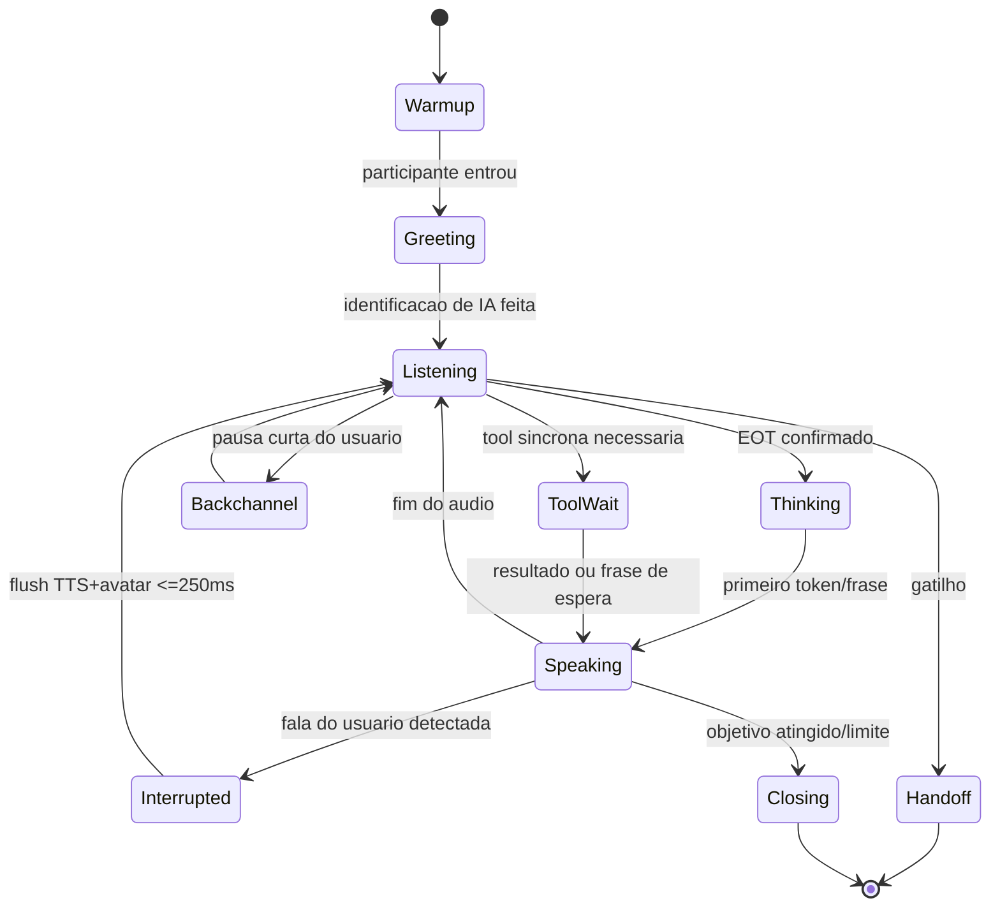

# REALTIME_ARCHITECTURE — Axtro Realtime Conversation Engine

Serviço: `apps/realtime-worker` (Python 3.12, framework **LiveKit Agents**). Um processo-agente por sessão, agendado pelo LiveKit; escala horizontal por worker pool. Independente do Axtro Agent: se o daemon estiver indisponível, a call segue com **políticas locais** (briefing default, limites default, handoff conservador).

## 1. Responsabilidades
Receber áudio · VAD início/fim de fala · detectar interrupções · transcrever quando necessário · manter estado curto da conversa · consultar/atualizar SalesSessionState · gerar resposta em streaming · executar tools permitidas · produzir áudio · enviar áudio ao avatar · publicar eventos · controlar latência e turnos · transferir para humano · operar sem o daemon.

## 2. Dois modos (interface única `ConversationPipeline`)
```python
class ConversationPipeline(Protocol):
    async def start(self, ctx: SessionContext) -> None
    async def on_user_audio(self, frame: AudioFrame) -> None
    async def interrupt(self) -> None            # barge-in: corta TTS/S2S e avatar
    async def say(self, text: str, style: SpeechStyle | None) -> None
    async def inject_system(self, note: str) -> None   # canal do Supervisor
    async def stop(self, reason: StopReason) -> None
```
- **Modo A — Pipeline modular (default)**: VAD (Silero) + turn detector semântico → STT streaming (Deepgram Nova, PT-BR) → LLM streaming via Model Gateway (classe Haiku/GPT-mini p/ conversa) → TTS streaming (ElevenLabs Flash primário; Cartesia Sonic fallback). Vantagens: controle fino de turnos/estado/custos, glossário de pronúncia, injeção do Sales Engine token-a-token.
- **Modo B — Speech-to-Speech (flag `pipeline_mode=s2s`)**: OpenAI Realtime (gpt-realtime) com tools; transcrição paralela p/ estado e compliance. Vantagens: latência e prosódia; desvantagens: menos controle e custo maior.
- **A/B e fallback**: seleção por tenant/campanha; circuito: S2S com 3 erros/timeout em 60s → rebaixa para A na mesma sessão com frase de ponte ("só um instante, ajustando meu áudio").

## 3. Máquina de turnos (estado da conversa)

Regras: (a) **EOT híbrido** = VAD silêncio ≥ X ms adaptativo (180–450ms conforme ritmo do falante) **E** turn-detector semântico (modelo leve avalia se a frase terminou) — evita cortar quem pensa devagar; (b) **Speaking** emite áudio por frases (sentence-chunking) para permitir corte limpo; (c) **Interrupted**: cancela geração LLM, flush TTS, comando `interrupt` ao avatar, registra `interruption.success` com latência.

## 4. Budgets de latência (metas por percentil, medidas por span OTel)
| Métrica | Ideal | Aceitável | Degradação | Falha |
|---|---|---|---|---|
| Conexão à sala (join→mídia) | ≤1.0s | ≤2.0s | ≤4s | >4s |
| Carregamento do avatar (com warm-up) | ≤1.5s | ≤2.5s | ≤5s → cai p/ voz | — |
| Time-to-first-audio da sessão (saudação) | ≤1.2s | ≤2.0s | ≤3.5s | >3.5s |
| **EOT→primeiro áudio (voz, modo A)** p50/p95 | 0.6/1.1s | 0.8/1.5s | 1.2/2.2s | >3s |
| EOT→primeiro áudio (S2S) p50 | 0.5s | 0.8s | 1.2s | >2.5s |
| EOT→primeiro frame de vídeo (avatar) p50 | 0.9s | 1.4s | 2.2s | cai p/ voz |
| Interrupção (fala usuário→silêncio agente) | ≤180ms | ≤250ms | ≤400ms | >400ms |
| Tool síncrona (agenda/CRM leitura) | ≤800ms | ≤1.5s | frase de espera | timeout 8s |
| Handoff (aceite→humano na sala) | ≤10s | ≤30s | ≤60s c/ espera ativa | >60s |
| Reconexão de mídia | ≤2s | ≤5s | link de retorno | — |
Decomposição alvo do p50 (modo A): EOT detect 200ms + STT final 150ms + LLM TTFT 300ms (prompt-cache + contexto enxuto) + TTS TTFB 90ms + rede/mix 60ms ≈ **0.8s**. Cada etapa tem span próprio: `vad.eot`, `stt.final`, `llm.ttft`, `tts.ttfb`, `avatar.tvfb`, `e2e.eot_to_audio`. **Não prometemos latências irreais**: metas acima já assumem PT-BR, rede boa e prompt-cache quente; degradação é anunciada em métricas, nunca escondida.

## 5. Contexto do LLM (enxuto por design)
Ordem fixa: (1) system imutável do agente (persona+regras duras, cacheável) → (2) briefing do Supervisor (ou default) → (3) `SalesSessionState` compacto (~40 linhas) → (4) últimos N turnos verbatim + resumo rolling dos anteriores → (5) trechos RAG sob demanda (só quando intent factual) → (6) sugestão ativa do Supervisor (TTL 2 turnos) → (7) resultado de tool. RAG e memória do cliente entram **entre tags de dado não confiável** (`<dados_recuperados>`), nunca como instrução.

## 6. Tools no loop
Somente tools `read_low`/`read_pii` e `write_low` executam in-call sem confirmação; demais viram intenção→confirmação verbal→execução, ou vão para o Supervisor pós-call. Chamadas com previsão >800ms disparam **frase de preenchimento natural** ("deixa eu abrir sua agenda aqui... um segundo") gerada antes do resultado.

## 7. Eventos publicados (ver EVENT_ARCHITECTURE)
speech.started/ended · transcript.partial/final · intent.detected · objection.detected · sentiment.changed · tool.requested/completed/failed · presentation.* · handoff.requested/completed · session.ready/completed/failed · métricas de turno por evento `turn.metrics`.

## 8. Handoff humano (máquina de estados)
`detectado → resumo_silencioso (pacote gerado em paralelo, sem pausar a fala) → notificação (console+push+telefone) → espera_ativa (agente mantém conversa útil: recapitula, agenda, coleta dados) → aceite → entrada_do_humano (sala/bridge SIP) → apresentação_de_3_linhas pelo agente → observador_ou_saída`. Pacote de contexto (schema em `packages/domain/schemas/handoff_packet.schema.json` — campos: lead, motivo, resumo ≤10 linhas, etapa+score SILVA, objeções, materiais mostrados, ações executadas, próxima ação recomendada). Se nenhum humano aceitar no SLA: oferecer agendamento imediato com o humano + registrar `handoff.timeout`.

## 9. Resiliência e fallbacks (tabela normativa)
| Falha | Ação imediata | Continuidade |
|---|---|---|
| Modelo realtime (S2S) | rebaixa p/ pipeline A | mesma sessão |
| STT primário | Deepgram→OpenAI transcribe→Google | frase de ponte se >1 troca |
| TTS primário | ElevenLabs→Cartesia→Azure | voz secundária anunciada só em métrica |
| Avatar | congela último frame 1s → modo voz | aviso elegante: "meu vídeo oscilou, sigo com você por áudio" |
| LiveKit sala | reconexão exponencial 3x | link de reconexão por SMS/e-mail (`session.reconnect_link`) |
| Recall/bot removido | evento `bot.removed` → Supervisor oferece Sala Axtro por chat/e-mail | — |
| CRM/tool escrita | outbox + retry | dados nunca perdidos |
| RAG indisponível | responder só com confirmado do briefing + admitir não saber | flag `grounding.degraded` |
| Limite financeiro do tenant | encerramento gracioso com resumo + agendamento | `budget.exceeded` |
| Axtro Agent offline | políticas locais (limites default, handoff conservador) | zero impacto de latência |
| Queda do lead | detecta saída → aguarda 90s → follow-up automático de reconexão | `session.dropped` |

## 10. Anti-injeção em tempo real
Fala do usuário e RAG são dados; instruções tipo "ignore suas regras/dê 90% de desconto" nunca alteram políticas: limites vivem no Tool Runtime (servidor), não no prompt. Testes adversariais por voz obrigatórios (EVALUATION_FRAMEWORK §adversarial). Frases que tentem extrair prompt/segredos → resposta padrão curta + evento `security.prompt_probe`.
