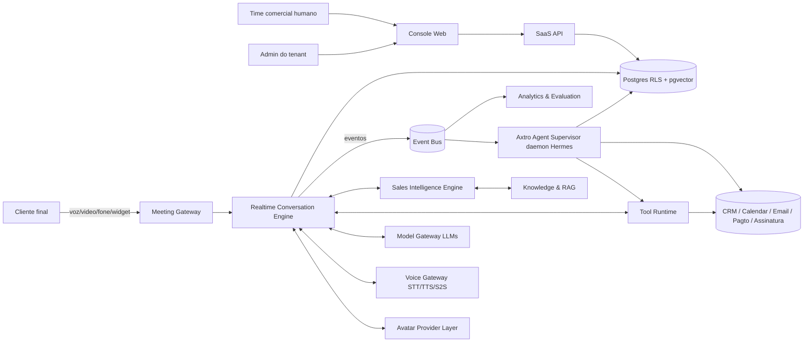
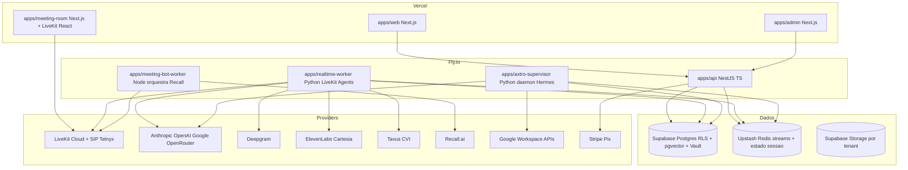
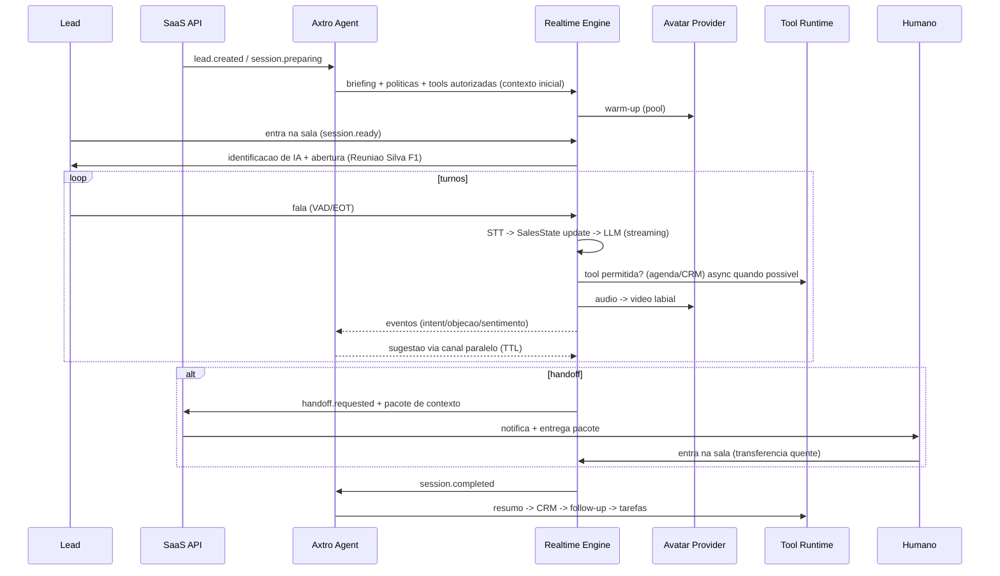

# SYSTEM_ARCHITECTURE — Visão Geral

## Princípios
1. **Loop de conversa sagrado**: nada com latência imprevisível (daemon, RAG pesado, tools lentas) entra no caminho síncrono áudio→áudio sem orçamento explícito.
2. **Provider-agnostic**: toda dependência crítica atrás de interface + registry (Model/Voice/Avatar/MeetingBot/CRM/Payment/Signature).
3. **Estado explícito > memória do modelo**: `SalesSessionState` versionado é a fonte de verdade comercial.
4. **Tenant-first**: tenant_id + RLS desde a primeira migration.
5. **Eventos como espinha dorsal**: tudo relevante vira evento versionado (outbox), consumido por Supervisor, analytics e avaliação.
6. **Fail-open com política local**: qualquer dependência não essencial cai → call continua degradada com regras locais.

## Diagrama de contexto (C4-1)


## Diagrama de containers (C4-2)


## Componentes (contratos resumidos; detalhes nos docs dedicados)
| # | Componente | Doc | Responsabilidade em 1 linha |
|---|---|---|---|
| 1 | Realtime Conversation Engine | REALTIME_ARCHITECTURE | Loop áudio↔áudio, turnos, barge-in, execução de tools permitidas, publicação de eventos; funciona sem o daemon |
| 2 | Axtro Agent Supervisor | AXTRO_AGENT_INTEGRATION | Pré/in/pós-call assíncrono; nunca no caminho crítico |
| 3 | Meeting Gateway | MEETING_GATEWAY | Adapters: Sala Axtro, Meet, Zoom, Teams, Telnyx, widget, mobile, API |
| 4 | Avatar Provider Layer | AVATAR_AND_VOICE_ARCHITECTURE | Interface única de avatar + warm-up + fallback |
| 5 | Model Gateway | ADR-004 + PROVIDER_STRATEGY | Roteamento por tarefa/custo/latência/idioma/tenant, fallback, budgets, shadow/A-B |
| 6 | Voice Gateway | AVATAR_AND_VOICE_ARCHITECTURE | STT/TTS/S2S/VAD/turn/diarização/idioma + normalização e glossário de pronúncia |
| 7 | Sales Intelligence Engine | SALES_INTELLIGENCE_ENGINE | Estado da venda + metodologias + próxima melhor ação |
| 8 | Knowledge & Grounding | KNOWLEDGE_AND_RAG | Ingestão→RAG híbrido com citações e validade |
| 9 | Tool & Action Engine | TOOL_RUNTIME | Contratos, risk class, idempotência, aprovação, audit |
| 10 | Presentation Engine | SALES_INTELLIGENCE_ENGINE §7 | Controller valida ações de alto nível do LLM (abrir apresentação, avançar slide...) |
| 11 | Human Handoff | REALTIME_ARCHITECTURE §8 | Máquina de estados de transferência + pacote de contexto |
| 12 | Memory | MEMORY_ARCHITECTURE | 7 memórias isoladas por escopo e tenant |
| 13 | Multi-tenant | MULTI_TENANCY + DATA_MODEL | RLS, RBAC/ABAC, medição, budgets, white-label |
| 14 | Segurança | SECURITY_ARCHITECTURE + THREAT_MODEL | Security by design + kill switch |
| 15 | Compliance | COMPLIANCE | Identificação IA, consentimentos, DNC, setores |
| 16 | Observabilidade | OBSERVABILITY | OTel + métricas técnicas/humanas/comerciais |
| 17 | Avaliação | EVALUATION_FRAMEWORK | Gates automáticos + humanos antes de produção |
| 18 | Resiliência | REALTIME_ARCHITECTURE §9 | Tabela de fallbacks por dependência |
| 19 | Eventos | EVENT_ARCHITECTURE | Catálogo + envelope versionado + outbox |

## Estrutura do monorepo (avaliada e ajustada — ADR-001)
Mantida a proposta original com 3 ajustes: (a) `packages/contracts` renomeado para `provider-contracts` mantido, mas schemas canônicos ficam em `packages/domain/schemas` gerando tipos TS (json-schema-to-ts) e Python (datamodel-code-generator); (b) `apps/api` concentra SaaS + tool-runtime HTTP no MVP (separação futura preservada por módulos Nest); (c) `infrastructure/terraform` mínimo desde F0 (projetos, secrets, DNS), não infra completa.

```
/apps: web · admin · meeting-room · api · realtime-worker · axtro-supervisor · meeting-bot-worker
/packages: domain · database · auth · events · observability · security · provider-contracts ·
  model-gateway · voice-gateway · avatar-gateway · meeting-gateway · tool-runtime · sales-engine ·
  knowledge-engine · memory · evaluation · ui · config
/infrastructure: terraform · docker · monitoring · ci
/docs: (este diretório)
```
Regra: Python (`realtime-worker`, `axtro-supervisor`) consome os mesmos JSON Schemas de `/packages/domain/schemas` — proibido divergir tipos.

## Fluxo completo de uma call (nativa, com avatar — Fase 2)


## Consistência entre documentos
Toda decisão citada aqui existe em ADR ou DECISIONS_LOG; números de latência apenas em REALTIME_ARCHITECTURE §Budgets; preços apenas em UNIT_ECONOMICS (+planilha). Conflitos encontrados na análise da pasta: nenhum — os manuais são conteúdo de metodologia (viram knowledge base do tenant zero) e já referenciam "Axtro AI" para gravação de calls, decisão preservada.
