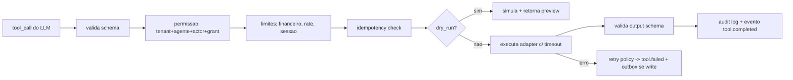

# TOOL_RUNTIME — Tool and Action Engine

Pacote `packages/tool-runtime` (execução server-side em `apps/api`; chamadas do realtime/supervisor via RPC interno autenticado). **Texto do LLM jamais executa código**: o LLM emite `tool_call {name, args}`; o runtime valida contra o contrato registrado e executa código nosso/adapters.

## 1. Contrato de tool (schema em `packages/domain/schemas/tool_contract.schema.json`)
name+semver · description · input_schema/output_schema (JSON Schema, validação estrita, additionalProperties:false) · **risk_class** · tenant_scoped:true · timeout_ms · idempotency: required|optional (chave = hash(session,tool,args_norm)) · retry{max,backoff} · dry_run_supported · requires_confirmation (verbal do cliente e/ou aprovação humana) · rollback: none|compensating(tool) · limits{financial_max, per_session_max, per_day_max} · approval_policy · audit: full|redacted · allowed_actors[realtime,supervisor,console].

## 2. Risk classes → política
| Classe | Exemplos | In-call? | Confirmação | Aprovação humana |
|---|---|---|---|---|
| read_low | knowledge.search, calendar.list_slots | sim | não | não |
| read_pii | crm.get_contact | sim (campos permitidos) | não | não |
| write_low | crm.log_activity, followup.create_task | sim | não | não |
| write_medium | calendar.schedule_meeting, crm.update_opportunity, presentation.open | sim | verbal quando afeta o cliente | não |
| write_high_financial | payment.create_charge, discount.apply, proposal.send, esign.send | não direto: intenção→confirmação verbal explícita→execução | sim | acima de limits → sim |
| irreversible | crm.delete_*, refund.execute | nunca in-call | — | sempre + dry-run obrigatório |

## 3. Pipeline de execução

Toda execução: audit imutável {trace_id, actor, tenant, args redigidos por política, resultado, custo, duração}. Escritas externas passam por **outbox** (exactly-once efetivo por idempotência no destino quando o provider suportar; senão, dedup por chave).

## 4. Catálogo inicial
F1: knowledge.search · calendar.list_slots/schedule_meeting (Google, OAuth por tenant) · crm.upsert_lead/update_opportunity/log_activity/create_task (CRM-lite) · handoff.request · followup.send_email (fila; template aprovado) · session.send_reconnect_link. F2: presentation.* · proposal.generate/send · payment.create_link (Stripe; Pix provider a decidir) · esign.send · sms.send (Telnyx) · notify.webhook. F4: adapters hubspot/pipedrive/rdstation via `provider-contracts/crm.ts`. Cotadores/geradores por vertical = tools de tenant registradas com o mesmo contrato (sem código arbitrário: apenas HTTP declarativo com schema + allowlist de host).

## 5. Defesas específicas
Tool-injection: nomes/args nunca interpolados em shell/SQL (adapters tipados, queries parametrizadas). SSRF: adapters HTTP só para hosts allowlisted por tenant, sem redirecionamentos externos, bloqueio de IP privado. Exfiltração: outputs de read_pii filtrados por field-allowlist do grant. Aprovação humana: fila no console com preview do dry-run, expira em 24h. Kill switch por tool/tenant/global. 
