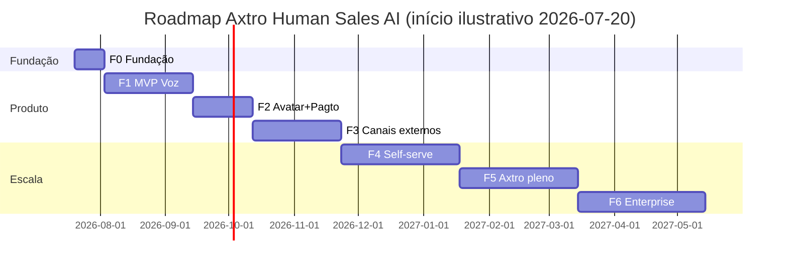

# ROADMAP.md — F0 a F6

> Status: PROPOSTO. Datas são estimativas de esforço relativo (o fundador executa com Claude Code; ritmo real calibra após F0). Cada fase tem **critério de saída mensurável** — não se avança sem ele.

## 1. Visão em uma linha por fase
- **F0 · Fundação (semanas 1–2):** monorepo, CI, Supabase+RLS, esqueleto dos 5 apps, schemas do domínio, seed tenant zero. *Saída:* pipeline de PR verde com testes de isolamento RLS passando; "hello session" de voz local com providers fake.
- **F1 · MVP Closer de Voz (semanas 3–8):** Sala Axtro (link web), pipeline voz completo com fallbacks, Sales Engine + SILVA + Método Silva, RAG dos 8 manuais, Google Calendar, CRM-lite, handoff quente, resumo+follow-up, dashboard mínimo, evals G1–G4 rodando. *Saída:* 10 conversas reais de venda do próprio Método Silva (tenant zero) com naturalness ≥4,0, zero violação crítica, show rate medido.
- **F2 · Avatar + Pagamentos (semanas 9–12):** Tavus CVI na Sala Axtro, tool de payment link (Stripe) com aprovação, clonagem de voz com consentimento, load test 50 sessões. *Saída:* demo por vídeo ponta a ponta fechando venda com pagamento em staging; custo/min real ≤ 25% acima do projetado.
- **F3 · Canais externos (semanas 13–18):** Meet/Zoom via Recall Output Media, telefonia BR + horários/DNC, WhatsApp para follow-ups (Cloud API), NATS JetStream. *Saída:* reunião no Google Meet conduzida pelo agente com gravação consentida e handoff.
- **F4 · Multi-tenant self-serve (semanas 19–26):** onboarding sem toque (wizard: conhecimento→voz→agente→número), billing por uso+plano, gate G6 por tenant, DPIA, pen test. *Saída:* 3 tenants pagantes externos ativos sem intervenção manual.
- **F5 · Axtro Agent pleno (semanas 27–34):** daemon Hermes com skills completas (otimização de prompts por tenant, experimentos A/B propostos→aprovados, coaching de time humano), self-host LiveKit avaliado. *Saída:* ≥1 melhoria/semana proposta pelo daemon e aceita, com lift medido.
- **F6 · Enterprise (semanas 35+):** SSO/SAML, auditoria exportável, SLAs, região dedicada, marketplace de metodologias, modelo próprio avaliado.

## 2. Gantt macro

## 3. O que fica explicitamente FORA até F4
Outbound frio massivo (o benchmark mostrou que é o segmento em colapso — focamos conversa quente) · SMS marketing · discador preditivo · integrações CRM além de HubSpot/Pipedrive/lite · mobile · i18n além de PT-BR/EN/ES.

## 4. Gatilhos de replanejamento
Custo/min real >40% acima do projetado por 2 semanas ⇒ pausa de fase e força-tarefa de custo. Naturalness <3,5 por 2 releases ⇒ congela features, só qualidade. Tavus instável (≥3 incidentes/mês) ⇒ antecipar avaliação HeyGen.
